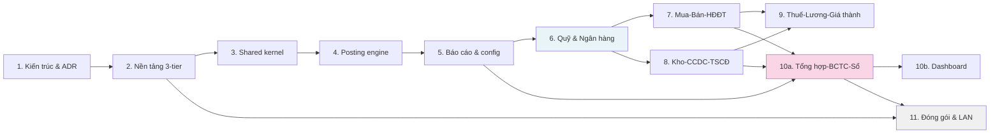

# Lộ trình dự án Konek Két v1 (12 mục phase, 11 mốc đánh số, ~70 dev-week)

**Ghi chú:** Phase 10 tách thành 10a + 10b (RT-20) → 12 mục; mốc đánh số tới 11 do 11 phase gốc.

## 1. Bảng 12 phase

| Phase | Tên | Ưu tiên | Phụ thuộc | Effort | Đầu ra chốt | Trạng thái |
| --- | --- | --- | --- | --- | --- | --- |
| **1** | [Kiến trúc tổng thể & ADR](../plans/260814-2204-accounting-system-architecture/phase-01-ki-n-tr-c-t-ng-th-adr.md) | P1 | — | 2w | 19 ADR; `docs/system-architecture.md`; khung repo rỗng chạy được | **Xong** (2026-08-15) |
| **2** | [Nền tảng kỹ thuật 3-tier](../plans/260814-2204-accounting-system-architecture/phase-02-n-n-t-ng-k-thu-t-3-tier.md) | P1 | 1 | 5w | FastAPI + SQLAlchemy + Alembic; schema-per-dataset routing; RBAC + RLS + audit owner-split; Tauri+React shell; handshake schema-version (LD-05); **S1, S3, S4** | **Đang làm** — lát 2A (nền dữ liệu & bảo mật) xong 2026-08-15; còn 2B (API) + 2C (client, spike) |
| **3** | [Shared kernel nghiệp vụ](../plans/260814-2204-accounting-system-architecture/phase-03-shared-kernel-nghi-p-v.md) | P1 | 2 | 5w | Danh mục, chiều phân tích (6 cột + mở rộng), đa tiền tệ, kỳ, chi nhánh, đánh số, import Excel | **Đang làm** — lát 3A xong 2026-08-17; lát 3B-1 xong 2026-08-17 (registry + 15 danh mục + chiều phân tích); lát 3B-2 xong 2026-08-17 (partners, employees, gộp bản ghi, BFF thiết lập); lát 3B-3 xong 2026-08-18 (items + 2 bảng con + 3 cơ chế chung); lát 3C/3D chưa làm |
| **4** | [Posting engine & sổ cái 2 sổ](../plans/260814-2204-accounting-system-architecture/phase-04-posting-engine-s-c-i-hai-s.md) | P1 | 3 | 6w | `gl_postings` append-only, state machine, snapshot số dư (khóa compact), khóa kỳ, integrity checker; **S5 set-based recalc** | Pending |
| **5** | [Hạ tầng báo cáo & gói config TT200/TT133](../plans/260814-2204-accounting-system-architecture/phase-05-h-t-ng-b-o-c-o-g-i-c-u-h-nh-tt200-tt133.md) | P1 | 4 | 6w | Report engine metadata-driven; WeasyPrint + openpyxl sandbox; gói config ký số; **S2 go/no-go renderer cuối phase** | Pending |
| **6** | [Dòng tiền: Quỹ & Ngân hàng](../plans/260814-2204-accounting-system-architecture/phase-06-d-ng-ti-n-qu-ng-n-h-ng.md) | P1 | 5 | 4w | QUY+BNK vertical slice; hàng đợi thủ quỹ; **khai mọi kernel Protocol chạm 7/8**; đóng băng kernel API | Pending |
| **7** | [Mua – Bán – Công nợ & HĐĐT](../plans/260814-2204-accounting-system-architecture/phase-07-mua-b-n-c-ng-n-h-t.md) | P1 | 6 | 7w | PUR + SAL + EIV + INV + module `receivables` AR/AP; **ký esign đồng bộ** lúc phát hành; outbox | **Đang làm** — lát 7A xong 2026-09-01 (sổ phụ công nợ `ar_ap_ledger` + module `receivables`); lát 7B xong 2026-09-03 (module `purchase` server — hóa đơn mua, chi phí mua hàng phân bổ, guard ngưỡng nợ đối tác FR-SYS-032; chưa có UI client); **7C tách ba lát** (user chốt 2026-09-04) — lát 7C-1 xong 2026-09-04 (danh mục **bảng giá** thứ 22 + bảng giá nhiều mức theo đơn vị FR-SYS-042 + bậc chiết khấu theo số lượng FR-SYS-045 + tùy chọn giá sau thuế FR-SYS-043 + bộ định giá `kernel/pricing`; chưa có UI client), lát 7C-2 xong 2026-09-05 (module `sales` server — hóa đơn bán năm nghiệp vụ, chiết khấu thương mại trừ thẳng trên dòng, trả lại/giảm giá đối trừ hóa đơn gốc, định giá theo lô; chưa có UI client), còn 7C-3 (GLE sinh sổ phụ + check toàn vẹn 131/331), 7D–7H |
| **8** | [Kho & CCDC & TSCĐ](../plans/260814-2204-accounting-system-architecture/phase-08-kho-ccdc-tsc.md) | P1 | 6 | 7w | STK + CCD + TSC; giá xuất 4 PP; recalc lùi ngày; khấu hao; phân bổ; số dư đầu kỳ nhóm 5–9 | Pending |
| **9** | [Thuế – Lương – Giá thành](../plans/260814-2204-accounting-system-architecture/phase-09-thu-l-ng-gi-th-nh.md) | **P1** | 7, 8 | 6w | TAX tờ khai config (bỏ TTĐB/tài nguyên/nhà thầu); PAY bảng lương; CST giá thành 2 PP | Pending |
| **10a** | [Tổng hợp – Khóa sổ – BCTC – Sổ **[CỔNG PHÁT HÀNH]**](../plans/260814-2204-accounting-system-architecture/phase-10-t-ng-h-p-kh-a-s-bctc.md) | **P1** | 5, 7, 8 | 5w | Bút toán cuối kỳ; BCTC 2 chế độ; **3 hình thức sổ (FR-GLE-047 MUST)**; quy tắc khóa sổ; drill-down lên GL | Pending |
| **10b** | [Dashboard phân tích tài chính](../plans/260814-2204-accounting-system-architecture/phase-10b-dashboard-ph-n-t-ch.md) | P2/P3 | 10a | 3w | 6 nhóm biểu đồ (SHOULD/COULD); **hoãn được sau release** | Pending |
| **11** | [Đóng gói & triển khai LAN](../plans/260814-2204-accounting-system-architecture/phase-11-ng-g-i-tri-n-khai-lan.md) | P1 | 2 (bắt đầu), 10a (chốt) | 4w | Installer 1-bấm Python; backup/restore per-schema **mã hóa**; auto-restore; benchmark hiệu năng | Pending |

**Ưu tiên chuẩn (RT-20, D4):** phase 9 + 10a = **P1** vì mang FR MUST (Thuế SRS 12, GL/BCTC SRS 15). Phase 10b = **P2/P3** (SHOULD/COULD, hoãn được).

---

## 2. Sơ đồ flowchart lộ trình

---

## 3. Các mốc chính (Milestones)

| Mốc | Phase | Nội dung | Lý do |
| --- | --- | --- | --- |
| **Nền tảng xong** | Cuối 2 | FastAPI + SQLAlchemy + schema-per-dataset + RBAC + RLS + audit owner-split; spike S1, S3, S4 đạt | Ghi nhật ký + cô lập + phân quyền phải có trước khi viết logic |
| **Kernel đóng băng** | Cuối 6 | Mọi Protocol chạm 7/8 phải khai; `ket.kernel` API gần như **không đổi** | Phase 7 + 8 chạy song song; thay đổi kernel sau đó phải ADR bổ sung (RT-18) |
| **Go/No-go renderer** | Cuối 5 | WeasyPrint + mẫu in đạt ngưỡng FR-NFR-041 (Sổ Cái cả năm < 10s); plan-B sẵn sàng | Trước khi soạn 155 mẫu in trong phase 7–10 |
| **Schema + API lõi đóng băng** | Cuối 6 | Không thêm migration schema kernel/posting | Phase 7/8 phải cam kết các chiều mở rộng (role mapping, dimension, bank profile) — không sửa lại schema lõi |
| **Cổng phát hành** | Cuối 10a | Tổng hợp, khóa sổ, BCTC, 3 hình thức sổ chạy xanh; **phase 10b (dashboard) hoãn được sau** | Release candidate v1.0; production ready |
| **Installer + benchmark** | Cuối 11 | Cài đặt người không IT trong <30 phút; đo hiệu năng 100k chứng từ/năm; mục tiêu backup/restore mã hóa chạy | Bàn giao cho đội vận hành / khách hàng pilot |

---

## 4. Năm spike bắt buộc (Blocking gates — không phải việc làm thêm, RT-25)

Mỗi spike là **cổng chặn (blocking gate)** — trượt → quay lại quyết định kiến trúc.

| # | Spike | Mục tiêu | Cổng đặt ở | Tiêu chí đạt | Plan-B (ghi sẵn) |
| --- | --- | --- | --- | --- | --- |
| **S1** | Tích hợp esign.konek.vn ký XAdES XML HĐĐT | Gọi dịch vụ esign (sidecar IPC/HTTP) hoặc tái dùng module `pkcs11`/`tsa`/`cert`; ký thử token thật VNPT/Viettel/FPT trên **macOS + Windows** | Cuối phase 2 | Ký XAdES thành công macOS + Windows; không lỗi cryptoki | Dịch vụ HTTP hoàn toàn tách khỏi app server (sidecar độc lập) |
| **S2** | WeasyPrint bundling + hiệu năng | Bundle GTK/pango/cairo Windows; Sổ Cái cả năm (~50k dòng) render < ngưỡng FR-NFR-041 | **Đóng gói phase 2 (S4), go/no-go phase 5 TRƯỚC soạn 155 mẫu** | Sổ Cái 50k dòng render PDF < 10s (hoặc chốt lại ngưỡng nếu rebaseline); installer chứa binary WeasyPrint | Engine PDF khác: Playwright/Chromium headless hoặc Typst (CSS subset) |
| **S3** | Lưới nhập liệu web 500 dòng + IME tiếng Việt | React component lưới có thể nhập 500 dòng, IME tiếng Việt không trễ, chuỗi dài không scroll ngang | Cuối phase 2 | Nhập 500 dòng 3 cột không lag (target <16ms frame time); IME Việt gõ không trễ; chứng minh Konek design token hoạt động | AG Grid Enterprise (**phải mua license**; thử S3/S4 nếu timeout); Glide Data Grid |
| **S4** | Đóng gói server Python + native deps | PyInstaller onedir: Python 3.12 + WeasyPrint (pango/cairo/GTK) + psycopg3 + lxml + Alembic → **installer 1-bấm chạy được trên Windows + macOS** | Bản nháp phase 2, hoàn thiện phase 11 | Installer <200MB (hoặc mục tiêu hợp lý khác), cài 30 phút, chạy được on Windows 10+, cả macOS 12+ | CPython embedded nhúng sẵn hoặc PyInstaller alternative (không chuyển .NET — vi phạm LD-03) |
| **S5** | Set-based recalc giá xuất 100k dòng | SQL window function tính lại giá BQ tức thời khi chèn lùi ngày; dữ liệu **dày chiều** (RT-22) để đo đúng | Trong phase 4 | Recalc 100k dòng < 10s bằng SQL set-based (không vòng lặp Python); dữ liệu test bao gồm tất cả chiều phân tích đầy đủ | Chuyển phần lớn logic lên application layer; tái thiết kế schema snapshot (không mang chiều) |

---

## 5. Phạm vi v1 vs hoãn v1.1

| Hạng mục | v1 (MUST) | v1.1 (Hoãn) | Lý do / Đường mở rộng |
| --- | --- | --- | --- |
| **Danh mục & Thiết lập** | SRS 01 đầy đủ | — | Không cắt |
| **Số dư ban đầu** | SRS 02 (10 nhóm, ngày công ty) | Nhập giữa năm (OQ#6) | Tách "bắt đầu hạch toán" khỏi "đầu năm" để thêm sau |
| **Quỹ & Ngân hàng** | SRS 03, 04 đầy đủ | — | Không cắt |
| **Quản lý hóa đơn** | SRS 08 adapter + outbox | — | Tích hợp 1–2 nhà cung cấp |
| **Kho & CCDC & TSCĐ** | SRS 09, 10, 11 (schema có lô/serial) | **UI + báo cáo lô/serial** | Schema sẵn; UI nhập lô/serial hoãn v1.1 (RT-20) |
| **Giá thành** | **2/5 phương pháp** (giản đơn + công trình/vụ) | 3 phương pháp khác (hệ số-tỷ lệ, đơn hàng, hợp đồng) | Pipeline 5 bước; thêm strategy sau (phase 9) |
| **Hình thức sổ** | **Cả 3 hình thức (FR-GLE-047 MUST)** | — | NJ chung, Chứng từ ghi sổ, NJ-GL; "Chứng từ ghi sổ" = loại CT mới (phase 10a) |
| **Thuế** | Tờ khai GTGT/TNDN/TNCN (config) | TTĐB, tài nguyên, nhà thầu | Đặc thù ngành hoãn (phủ bằng chiều mở rộng + config — RT-20) |
| **Hợp đồng & Ngân sách** | Chiều `contract_id` sẵn schema | SRS 16 đầy đủ (CTR module) | COULD, hoãn sau v1 (phạm vi v1, FR-NFR-070) |
| **Báo cáo 4 form BCTC** | BCTC 4 báo cáo, drill-down GL | — | Không cắt |
| **BFF thẻ công nợ đối tác** | — | `GET /partners/{id}/overview` (phase 7) | Thẻ công nợ đọc `ar_ap_ledger` của module `receivables`, mà module đó có ở phase 7. Dựng BFF ở phase 3 thì nó chỉ đọc **một** module — RT-21 cho phép BFF khi và chỉ khi màn hình đọc ≥2 module. Hoãn sang phase 7 (H56) |
| **Dashboard phân tích** | — | **SRS 18 §4 (6 nhóm biểu đồ)** | SHOULD/COULD, hoãn v1.1; tách phase 10 → 10a/10b |
| **Column-designer / Mail-merge** | — | FR-RPT-004/005/009/013 | End-user tùy chỉnh báo cáo / mail-merge tờ khai (phase 5, hoãn — RT-20) |
| **Đặc thù ngành (SRS 20)** | — | — | Phủ bằng chiều mở rộng + gói config; không code riêng theo ngành |

---

## 6. Song song hóa

**Phase 7 và 8 chạy song song được** sau khi phase 6 xong, **điều kiện: kernel + posting API đóng băng** (mục tiêu cách).

Ranh giới chia sẻ:
- `ket.kernel` (danh mục, chiều, đánh số, config) — tất cả phase dùng, không đổi
- `ket.posting` (gl_postings, posting service) — tất cả module gọi, không đổi
- Module riêng (PUR, SAL, EIV ở phase 7; STK, CCD, TSC ở phase 8) — **tách hoàn toàn**, không import lẫn nhau

---

## 7. Cơ sở ước lượng

**~70 dev-weeks**, giả định:
- **2 dev backend Python** (FastAPI, SQLAlchemy, posting logic, reporting, worker, integration adapter)
- **1 dev client Tauri/React** (TypeScript, design system Konek, form + grid + CRUD)
- **0.5 dev-design** (token setup, component base, UX review — không phát triển tính năng)

**Không gồm phase 10b** (dashboard — +3w).

**Biến số (trigger re-estimate):**
- OQ#3 chốt quy mô lớn hơn (> 100k ct/năm, > 20 user) → chạy lại spike S2, S5
- Khách hàng yêu cầu 5 phương pháp giá thành (thay vì 2) → +2w phase 9
- Trươc khi phase 3 bắt đầu, phải chốt OQ#4 (phạm vi nối bản cài) — mặc định: một chiều, UUIDv7

---

## 8. Bảng open questions còn mở

Mỗi câu có **chủ sở hữu + hạn + mặc định an toàn** (thi công theo mặc định nếu chưa chốt).

| # | Câu hỏi | Chủ / Hạn | Mặc định thi công | Nếu lật |
| --- | --- | --- | --- | --- |
| #1 | **Nhà cung cấp HĐĐT** (1–2 nhà)? | KD / trước phase 7 | Adapter interface + 1 provider sandbox; chốt tên trước code | Thêm provider sau (tách adapter) |
| #2 | **Ký số từ xa NĐ130/2018** (headless)? | KD / khi cần | Không v1; USB token qua esign là chính (D3) | Thêm `RemoteSigner` sau LD-04 |
| #3 | Quy mô dữ liệu mục tiêu? | User / trước phase 4 | **100k ct/năm, 20 user (xác nhận 2026-08-15)** | Chạy lại spike S2/S5 ở quy mô mới |
| #4 | Phạm vi nối bản cài (1 chiều vs 2 chiều)? | Arch / **trước phase 3** | **Một chiều: tổng hợp lên trụ sở (xác nhận 2026-08-15)**; danh mục UUIDv7; rt-19 | Thêm policy xung đột nếu 2 chiều |
| #5 | Số dư quản trị khác tài chính? | User / trước phase 4 | **Schema mang cột `ledger`, UI nhập riêng HOÃN (xác nhận 2026-08-15)**; FR-OPB-008 SHOULD | UI nhập 2 sổ riêng ở v1 (thêm phase 4) |
| #6 | Nhập số dư giữa năm? | User / trước phase 4 | Không; tách "ngày bắt đầu" khỏi "đầu năm" nếu cần | Thêm UI khai giữa năm + đánh dấu dừng phát sinh cũ |
| #7 | Khóa kỳ toàn kỳ hay theo phân hệ? | User / trước phase 4 | Toàn kỳ (đơn giản, đúng luật) | Thêm granularity per-module (phức tạp) |
| #8 | Lưu trữ 10 năm: DB hay partition? | Arch / trước phase 11 | Partition theo năm nếu kích thước vượt ngưỡng; mặc định GB toàn bộ | Tách data warehouse + ETL (thêm hạ tầng) |
| #11 / RT-11 | **Tính lại cắt kỳ khóa** — chặn hay reversal? | **Kế toán trưởng / gate phase 8** | **Chặn + hiện preview FR-STK-003 (xác nhận cấu trúc)**; chờ kế toán trưởng quyết | Thêm bút toán đảo khi recalc cắt kỳ khóa |

**Chốt (ngày 2026-08-15):** OQ#3, #4, #5, #9 → xác nhận mặc định. Còn mở với chủ sở hữu: #1, #2, #6, #7, #8, #11.

---

## 9. Tham chiếu

- **Chi tiết mỗi phase:** `../plans/260814-2204-accounting-system-architecture/phase-0X-*.md`
- **Locked Architecture Decisions:** `../plans/260814-2204-accounting-system-architecture/plan.md` §Locked Architecture Decisions (LD-01..16)
- **Red Team Review:** `../plans/260814-2204-accounting-system-architecture/plan.md` §Red Team Review (RT-01..27)
- **Validation Log:** `../plans/260814-2204-accounting-system-architecture/plan.md` §Validation Log (OQ chốt)
- **SRS requirement:** `docs/srs/00-20` (504 FR, 109 BR)
