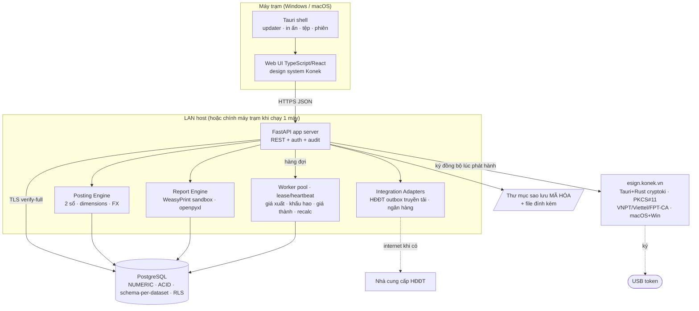
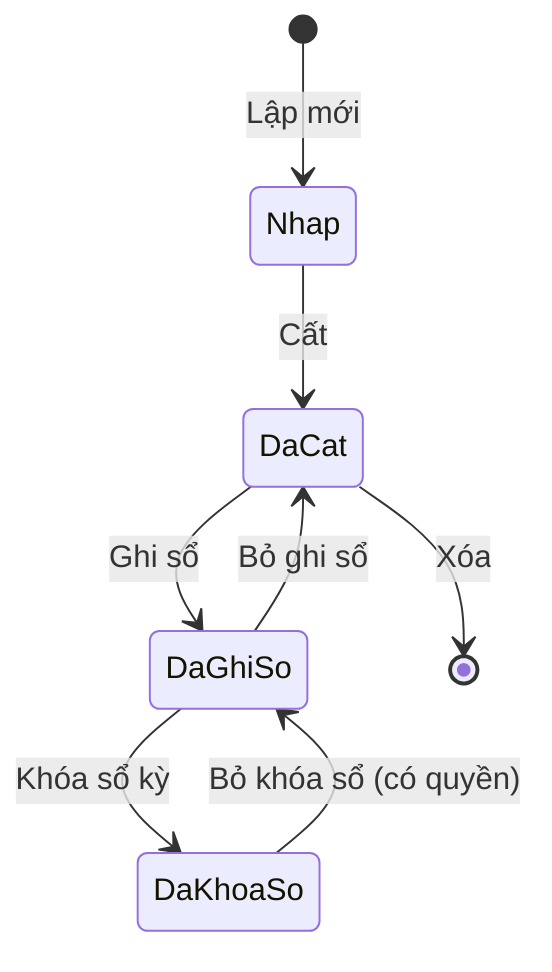

# Kiến trúc hệ thống Konek Két (v1)

> **Tài liệu này mô tả kiến trúc ĐÍCH của cả v1**, phần lớn chưa dựng. Phần đã
> chạy thật tới hôm nay xem §1b; chi tiết mã nguồn hiện có xem
> `docs/codebase-summary.md`. Đọc nhầm tài liệu này thành "hệ thống hiện tại" là
> hiểu sai khoảng 90% nội dung.

## 1. Mục tiêu & bối cảnh

Phần mềm kế toán doanh nghiệp Việt Nam chạy **offline hoàn toàn trên một máy hoặc LAN** (mô hình desktop tại từng máy trạm + DB dùng chung). Không cloud v1. Đáp ứng TT99/TT133, xử lý trọn vòng đời chứng từ, hỗ trợ đa chi nhánh, đa tiền tệ, HĐĐT.

**Ba mục tiêu chất lượng chi phối thiết kế, theo thứ tự:**
1. **Đúng số liệu** (FR-NFR-001..007) — sai số liệu thì mọi ưu điểm khác vô nghĩa.
2. **Cấu hình thay vì sửa code** (FR-NFR-055, N7) — khi thông tư thay đổi, kích hoạt gói cấu hình, không sửa mã nguồn.
3. **Không phải viết lại** (N1, LD-03) — khi thêm phân hệ, thêm báo cáo, nối nhiều bản cài → kiến trúc lõi chịu được.

---

## 1b. Trạng thái hiện thực hóa (2026-08-20, lát 4F)

| Thành phần | Trạng thái |
| --- | --- |
| Vai trò DB `ket_owner` / `ket_app`, tách quyền sở hữu | ✅ chạy thật |
| Schema-per-dataset: schema điều khiển, provisioning, định tuyến `search_path` | ✅ chạy thật |
| Migration `0001` — 12 bảng nền (RBAC, settings, audit, idempotency, jobs, numbering, branches, attachments) | ✅ chạy thật |
| Migration `0003` — 15 bảng danh mục + 2 bảng chiều phân tích | ✅ chạy thật (3B-1) |
| Migration `0004` — Hai danh mục mới: `partners` (14 cột) + `employees` (9 cột) + bảng con `partner_bank_accounts` | ✅ chạy thật (3B-2) |
| Migration `0005` — Danh mục vật tư `items` (4 cột riêng: `nature`, `base_unit_id`, `warehouse_id`, `description`) + hai bảng con: `item_units` (quy đổi **phẳng** về đơn vị chính) + `item_variants` (mã quy cách — trục khóa của bảng tồn kho phase 8); `NUMERIC(20,6)` cho số lượng + tỷ lệ | ✅ chạy thật (3B-3) |
| Migration `0011` — `statement_layouts` + `statement_rows` (layout BCTC + dòng chỉ tiêu, khóa `(package_id, code)`/`(layout_id, row_code)`, không RLS, gói cấu hình chứ không per-dữ-liệu) | ✅ chạy thật (5B) |
| Migration `0012` — `entry_kind` trên `vouchers` (nguồn sự thật) + `gl_postings` (denormalize): bản chất bút toán (LD-17) — B02 lọc bút toán kết chuyển khỏi phát sinh, số dư luôn gồm mọi bút toán; bảng cân đối TK + BCTC gộp theo **số hiệu TK** (không theo `account_id` — TK thuộc gói cấu hình) | ✅ chạy thật (4F) |
| **Formula engine & statement builder (lát 5B)** — `ket.kernel.config.statements` (grammar 7 hàm, evaluator tô-pô, account range), `ket.reporting.statements` (builder lấy `opening_balances`+`gl_postings` — KHÔNG snapshot, API `/api/v1/statements` + `/api/v1/statements/{layout_code}/preview`, quyền `reporting.statement.view`, layout giải quyết qua `resolve_package(scheme, cuối_kỳ)`) | ✅ chạy thật (5B) |
| RLS cô lập chi nhánh theo GUC `ket.branch_ids` | ✅ chạy thật (trên `audit_log`, `jobs`, `attachments`). **Danh mục cố ý KHÔNG bật RLS** — `branch_id IS NULL` = dùng chung toàn công ty (FR-SYS-018), mà policy chi nhánh sẽ giấu đúng những dòng đó; lọc theo chi nhánh nằm ở `MasterDataService._visible_to` + tầng HTTP (H39) |
| Nhật ký bất biến ghi cùng transaction | ✅ chạy thật |
| `ket.kernel.money` — Decimal, ROUND_HALF_UP | ✅ chạy thật |
| Kiểm phiên bản schema lúc khởi động (LD-05) | ✅ chạy thật |
| **Cô lập dataset bằng vai trò per-dataset `ds_<mã>_app` (D3)**; luật cứng AST quét tiêm SQL | ✅ chạy thật (2B-0) |
| **PostgreSQL 16 là phiên bản tối thiểu (D4)**; app từ chối PG < 16 | ✅ chạy thật (2B-0) |
| **Kênh phát hành Windows+macOS** (release.yml, minisign ký gói updater) | ⚠️ đã dựng, **chưa chạy lần nào** — đường build Windows chưa xác minh (máy phát triển là macOS); bộ cài chưa ký chứng thư OS |
| **Danh tính**: Argon2id, phiên lưu DB thu hồi được ngay, 2FA TOTP chống phát lại, khóa tạm, RFC 7807 | ✅ chạy thật (2B-1a) |
| **RBAC enforcement** `{module}.{chứng từ}.{hành vi}` sinh từ registry; định tuyến dataset theo header `X-Dataset`; phạm vi chi nhánh cho RLS | ✅ chạy thật (2B-1b) |
| **Idempotency cùng transaction** (giành khóa → làm việc → điền kết quả); **khóa lạc quan `row_version` hai lớp**; **tùy chọn hai cấp**; **hạn mức request theo người gọi** | ✅ chạy thật (2B-2a) |
| **Tiến trình worker nền** (giành job `FOR UPDATE SKIP LOCKED`, chạy dưới vai trò dataset); **lease/heartbeat/reaper** chống job mồ côi; **vai trò `ket_worker`** (`SELECT` + `UPDATE` theo cột trên `jobs`, có hàng rào lease); **API `/api/v1/jobs` + OpenAPI sinh type TS** | ✅ chạy thật (2B-2b) |
| **Endpoint bắt tay `/api/v1/system/handshake`** (ẩn danh) — phiên bản server/client tối thiểu/schema | ✅ chạy thật (2C-1) |
| **Cổng phiên bản client** — thiếu/sai `X-Client-Version` trên lệnh ghi → `426` (fail-closed) | ✅ chạy thật (2C-1) |
| **CORS cho webview Tauri** — danh sách origin đóng, middleware ngoài cùng, preflight trước hạn mức | ✅ chạy thật (2C-1) |
| **Design system tối thiểu** (`Button`, `TextField`, `SelectField`, `Alert`) + layout vỏ ứng dụng + sidebar/topbar | ✅ chạy thật (2C-1) |
| **Đường đăng nhập đầy đủ** — login, 2FA, đổi mật khẩu tạm, cần cập nhật, mất kết nối | ✅ chạy thật (2C-1) |
| **Chọn dữ liệu kế toán** — tự chọn khi bản cài chỉ có một; `401` ở bất kỳ request nào dọn phiên và đưa về màn đăng nhập | ✅ chạy thật (2C-1) |
| **i18n tự viết** (vi/en) — khóa phẳng + nội suy, kiểu enforce TypeScript | ✅ chạy thật (2C-1) |
| **Máy trạng thái phiên client** (7 trạng thái) — quyết định duy nhất ở `SessionGate` | ✅ chạy thật (2C-1) |
| **Bộ test client** vitest + testing-library, có cổng CI `make client-test` | ✅ chạy thật (2C-1) |
| **Tệp đính kèm** (FR-NFR-053) — kho định địa chỉ theo nội dung tách theo dataset, `/api/v1/attachments` có RBAC + RLS + idempotency, gỡ-không-xóa | ✅ chạy thật (2C-5) |
| **Khung danh mục dùng chung** — materialized path (cây ≥6 cấp, chuyển nhánh bằng **một** UPDATE), `MasterDataService[ModelT]` generic có kiểu, mã duy nhất theo phạm vi dùng-chung/riêng-chi-nhánh (BR-SYS-01), bộ đếm tham chiếu chặn xóa (BR-SYS-02) | ✅ chạy thật (3A) |
| **Sổ đăng ký danh mục** — `CatalogRegistry` + `CatalogSpec` (slug, model, extra_fields, flags, references); **router sinh tự động** từ registry — 7 thao tác/danh mục (GET/POST/PUT/DELETE/chuyển nhánh/gộp bản ghi), endpoint `/api/v1/master/{slug}`; quyền theo từng danh mục không mã chung `master.*` (H48) | ✅ chạy thật (3B-2) |
| **20 danh mục SRS 7 + 3 chiều lõi** — 15 danh mục (lát 3B-1) + `partners`/`employees` (3B-2) + `items` (3B-3). **Không** bật RLS — miễn trừ khai từng bảng trong `test_rls_policy_coverage.py` (H39, H53) | ✅ chạy thật (3B-1, 3B-2, 3B-3) |
| **Ba cơ chế chung của registry** — `merge_hooks` (tuple từ chối/chuẩn bị gộp bản ghi), `extra_update_fields` (trường chốt một lần), `update_guard` (luật liên-trường ở đường sửa) | ✅ chạy thật (3B-3, người dùng đầu: vật tư + bảng con đơn vị tính) |
| **Chiều phân tích mở rộng** — `analysis_dimensions` + `analysis_dimension_values`, `DimensionService`; gieo mầm chiều "Mã thống kê" (STAT, FR-SYS-051); `value_source` + `master_slug` phân tách (không chuỗi ghép, cho phép `CHECK` kiểm bất biến) | ✅ chạy thật (3B-1) |
| **Danh mục đối tác + nhân viên** — `partners` (một bản ghi, hai danh sách khách + NCC qua `is_customer`/`is_vendor`); `employees`; bảng con `partner_bank_accounts` (khóa ngoại `RESTRICT` sang `banks`) | ✅ chạy thật (3B-2) |
| **Bộ lọc `?flag=`** — `CatalogFlag` (cột boolean, giá trị tham số); sinh vào router tự động; dùng cho `partners` (khách/NCC) | ✅ chạy thật (3B-2) |
| **Kiểm khóa ngoại sang danh mục** — `CatalogReference` (trường + danh mục đích); router kiểm: nhìn thấy được từ chi nhánh + không phải nút nhóm; dùng cho `partners.payment_term_id`, `employees.bank_id` | ✅ chạy thật (3B-2) |
| **Gộp bản ghi** — `POST /api/v1/master/{slug}/actions/merge`; danh sách bảng tham chiếu từ `pg_catalog` lúc chạy; ba bảng mềm có chính sách (master_data_usage cộng dồn, attachments chặn, audit_log không đụng); bốn phép chặn (gộp vào chính, có nhánh con, scope hẹp hơn, chi nhánh khác); khóa idempotency | ✅ chạy thật (3B-2) |
| **BFF `/api/v1/setup/settings-groups`** — phân nhóm thiết lập theo `SettingDefinition.decided_once` (hai nhóm: đổi bất kỳ lúc + chốt một lần); gộp kernel/config + fiscal_years | ✅ chạy thật (3B-2) |
| **`uuid7` tự viết** (RFC 9562) cho cột `uid` ổn định của danh mục (RT-19) — Python 3.12 chưa có `uuid.uuid7()`, và `uuid-utils` là extension Rust nên tránh trước spike đóng gói S4 | ✅ chạy thật (3A) |
| **Đa tiền tệ** — `currencies`/`exchange_rates`, `MoneyFc` kiểm bất biến lúc dựng, tra tỷ giá gần nhất ≤ ngày; **thiếu tỷ giá là lỗi nghiệp vụ, không bao giờ mặc định 1** | ✅ chạy thật (3A) |
| **Năm tài chính & kỳ kế toán** — sinh đủ 12 kỳ liền mạch (hỗ trợ niên độ lệch), khóa/mở kỳ có vết người thực hiện, chồng lấn niên độ chặn bằng `EXCLUDE USING gist` ở DB | ✅ chạy thật (3A) |
| **Đánh số chứng từ** — `SELECT … FOR UPDATE` trong transaction của người gọi (rollback trả lại số), sổ cấp số cho dãy liên tục; kiểm bằng 20 luồng song song | ✅ chạy thật (3A) |
| **Cây chi nhánh** — `branches` mở rộng tại chỗ; mọi đường tạo đi qua `BranchService` | ✅ chạy thật (3A) |
| **Khung Excel nhập liệu** — `TemplateDescriptor` sinh tệp mẫu (sheet Hướng dẫn, cột `*`), bảng đệm `import_staging_rows`, kiểm set-based (hình thức → quan hệ → luật liên-trường), từ chối tệp đổi cấu trúc (FR-SYS-082); hai job kiểm/ghi chạy **cùng một hàm** (H85), so `content_hash` giữa kiểm và ghi (H78); ghi theo cấp cây bằng `INSERT … SELECT`; migration `0006` | ✅ chạy thật (3C-1) |
| **Xuất Excel + tự tạo danh mục thiếu + sao kê ngân hàng** — exporter dùng chung descriptor (round-trip xuất → nhập 0 lỗi, cả 20 danh mục); tự tạo danh mục còn thiếu (FR-NFR-062, ba hàng rào: người dùng chọn, `auto_creatable`, quyền per-danh-mục — `ON CONFLICT DO NOTHING` cho hai lượt nhập đồng thời); khung sao kê per-bank `bank_statement_profiles` **ngoài** strict-template (RT-26, migration `0008`; tệp thật VCB/ACB là nợ M1 — cổng chặn phase 6) | ✅ chạy thật (3C-2) |
| **UI nhóm 07 (client)** — màn danh mục cây+lưới cho cả 20 danh mục (registry client canh khớp `openapi.json` bằng test), drawer sửa theo U2, màn đối tác + thẻ công nợ giữ chỗ (H56), wizard nhập Excel 3 bước trên job nền, màn Thiết lập hai nhóm + banner U14; `TreePicker`/`LookupInput` vào design system | ✅ chạy thật (3D) |
| **Vòng đời job cứng hóa** — thân job gia hạn lease **theo lô** (đọc tệp) và **theo cấp cây** (pha ghi); cờ hủy kiểm ở ranh giới lô (`request_cancel` giữ đúng lời hứa); `Worker._fence_before_commit` gia hạn lease bằng chính transaction nghiệp vụ ngay trước commit — mất lease là rollback trọn, không còn cửa hai worker cùng commit một job; CLI `upgrade-datasets` nâng schema dataset đã tồn tại lên head (nửa vận hành của LD-05) | ✅ chạy thật (lát vá audit phase 1–3) |
| Posting engine, báo cáo, và toàn bộ phân hệ nghiệp vụ | ⏳ phase 4 trở đi |

Bảng còn lại trong §11 và phần lớn §12 là **thiết kế đích**, chưa có mã.

---

## 2. Bảy nguyên lý ràng buộc toàn hệ thống

| # | Nguyên lý (N) | Hiện thực hóa | ADR / Phase |
| --- | --- | --- | --- |
| N1 | Báo cáo chỉ từ chứng từ đã ghi sổ | Một bảng phát sinh chung `gl_postings` (append-only); không nhập trực tiếp sổ/báo cáo | ADR-005; phase-4 |
| N2 | Tách "cất" và "ghi sổ" | Chứng từ hai trạng thái; tùy chọn "cất không ghi sổ" hoặc "cất đồng thời ghi sổ" | phase-4 |
| N3 | Hai sổ song song (tài chính + quản trị) | Cột `ledger ENUM('financial','management')` trên tất cả bảng phát sinh + số dư | ADR-006; phase-4 |
| N4 | Đa chi nhánh | Mọi chứng từ gắn chi nhánh; cô lập bằng RLS trên bảng gốc (GUC tenant per-request) | RT-04; phase-2 |
| N5 | Đa tiền tệ | Mỗi dòng lưu bộ (currency, rate, amount_fc, amount_debit, amount_credit); sổ cái quy VND | phase-3, phase-4 |
| N6 | Kỳ khóa được | Sau khóa sổ, chứng từ trong kỳ chặn sửa/xóa; chứng từ lùi ngày có quy trình tính lại | phase-4, phase-8 |
| N7 | Chế độ kế toán là cấu hình | TT99/TT133 quyết định hệ thống TK, mẫu chứng từ, BCTC — tất cả dữ liệu config có hiệu lực theo ngày | ADR-008; phase-5 |

---

## 3. Sơ đồ thành phần



Ký số USB token nằm ở **dịch vụ esign riêng** trên máy người ký (không nhúng PKCS#11 vào app server — LD-04). App server gọi esign ký **đồng bộ trước khi đưa vào outbox**; outbox chỉ retry **truyền tải XML đã ký**.

---

## 4. Topology & chế độ triển khai

| Chế độ | Cấu hình | Ghi chú |
| --- | --- | --- |
| **LAN** (mặc định) | App server + PostgreSQL trên host (hoặc DB riêng); 5–50 client. Client bind URL `https://host:5443` | Cấu hình mạng; không nhánh code riêng |
| **Một máy (offline)** | App server + PostgreSQL + client cùng PC, bind `127.0.0.1` | Cùng binary, khác file cấu hình; offline hoàn toàn |
| **Tương lai v1.x: trình duyệt LAN** | App server phục vụ chính bundle web UI tại `/app`; dùng Chrome/Edge mở tại `https://host:5443/app` | Chỉ mất tính năng Tauri (USB token, in, chọn folder). **Không làm v1 nhưng cấm thiết kế chặn** |
| **Tương lai: nối nhiều bản cài** | Thêm module đồng bộ đọc/ghi qua REST API (đã có sẵn). **Cam kết v1: tổng hợp một chiều** lên trụ sở | Danh mục có `uid UUIDv7` ổn định để nối sau; RT-19 |

**Quy tắc bất di dịch:** client **không bao giờ nối thẳng PostgreSQL**. Mọi phép tính tiền, đánh số, ghi sổ, kiểm tra quyền đều ở server (loại 2-tier khỏi LD-01).

---

## 4b. Client, middleware và bắt tay phiên bản (lát 2C-1)

### Endpoint bắt tay (bước 19)

```
GET /api/v1/system/handshake        — ẩn danh, không chạm cơ sở dữ liệu
→ {
    "server_version": "0.6.0",
    "min_client_version": "0.6.0",
    "control_schema_version": "4",
    "deployment_mode": "standalone"      // hoặc "lan"
  }
```

Ẩn danh có chủ đích: đúng cái nó trả lời là câu hỏi *có đăng nhập được không*,
nên một client quá cũ phải biết ở màn hình đầu tiên chứ không phải sau khi người
dùng gõ xong mật khẩu. Vì ai trong LAN cũng đọc được, nội dung giữ ở mức tối
thiểu — không tên doanh nghiệp, không danh sách dữ liệu kế toán, không tên máy
chủ. Bộ trường này bị **khóa bằng test**, để lát sau không "tiện tay" thêm tên
công ty vào cho màn hình đăng nhập.

Client so bản đang chạy với kết quả bắt tay (`client/src/lib/app-version.ts`):
cũ hơn `min_client_version` → màn hình cần cập nhật; **mới hơn** `server_version`
→ chỉ hiện băng cảnh báo, vì việc phải làm khi ấy nằm ở máy chủ.
`control_schema_version` hiện chưa điều khiển hành vi nào của client — nó có mặt
để màn hình chẩn đoán và báo cáo sự cố nêu được một con số cụ thể.

### Cổng phiên bản client (H2)

Header `X-Client-Version: MAJOR.MINOR.PATCH` **bắt buộc** trên mọi lệnh ghi
(`POST`, `PUT`, `PATCH`, `DELETE`). Thiếu header, sai khuôn, hoặc cũ hơn
`min_client_version` → `426 Upgrade Required`:

```json
{
  "error_code": "system.client_version_unsupported",
  "details": { "client_version": "0.5.0", "min_client_version": "0.6.0" }
}
```

Lệnh **đọc** không bao giờ bị chặn — chế độ chỉ-đọc là thứ khiến cổng này an
toàn để bật: mất nó thì một lần tăng `min_client_version` nhầm làm cả văn phòng
dừng việc.

Thiếu header cũng chặn, chứ không cho qua: cổng fail-open chỉ chặn được client
**trung thực** — bản cũ chỉ cần bỏ header là đi vòng qua đúng cơ chế sinh ra để
chặn nó. Cùng khuôn với `X-Dataset` (thiếu là lỗi, không đoán mặc định).

Miễn trừ **năm** đường của `/auth`, danh sách đóng:

| Đường | Lý do |
| --- | --- |
| `POST /auth/login` | chế độ chỉ-đọc cần một phiên, mà phiên thì phải đăng nhập mới có |
| `POST /auth/logout` | thu hồi phiên phải chạy được ở mọi trạng thái |
| `POST /auth/change-password` | tài khoản mang mật khẩu tạm **không đọc được gì** (server trả `auth.password_change_required` ở mọi endpoint khác), nên chặn đường này là khóa cứng chứ không phải chỉ-đọc |
| `POST /auth/totp/enroll` | như trên, cho tài khoản bắt buộc 2FA chưa đăng ký thiết bị (phiên hạn chế) |
| `POST /auth/totp/confirm` | như trên |

Ba đường sau nới ra sau review lát 2C-1, khi đo được rằng một bản cài mới — nơi
**mọi** tài khoản đều mang mật khẩu tạm — sẽ không ai vào được nếu máy trạm chạy
bản client cũ hơn `min_client_version`. Nới mà không làm yếu cổng, vì chúng ghi
vào **schema điều khiển** (tài khoản, phiên) chứ không vào sổ sách; rủi ro mà
cổng sinh ra để chặn là "binary cũ ghi bút toán vào cấu trúc mới", và schema
điều khiển đã có `verify_control_schema` canh lúc khởi động.

Không có cờ tắt cổng. `main.py` đã có hai cờ tắt cho hai cổng khởi động, và mỗi
cờ là một công tắc sẽ bị quên ở vị trí tắt.

### CORS cho webview Tauri (H6)

Webview Tauri không chạy ở origin của app server (`tauri://localhost` trên
macOS; `http://tauri.localhost` và `https://tauri.localhost` trên Windows), nên
mọi lời gọi của client desktop là xuyên origin. Thiếu lớp này thì "đăng nhập từ
client Tauri" không chạy được, và triệu chứng là request bị trình duyệt chặn
**trước khi rời máy** — log máy chủ trống trơn.

- `allow_origins`: danh sách **đóng** từ `KET_CORS_ALLOWED_ORIGINS` (mặc định là
  ba origin Tauri ở trên). Không `*`.
- `allow_credentials`: **tắt** — phiên đi bằng header `Authorization` chứ không
  cookie, nên bật cờ đó chỉ mở rộng bề mặt CSRF.
- Vị trí: **lớp ngoài cùng** của chuỗi middleware. Preflight `OPTIONS` được trả
  lời trước hạn mức và trước cổng phiên bản, và **mọi** phản hồi — kể cả `429`,
  `426` — mang header CORS. Nằm trong thì một phản hồi bị chặn tới trình duyệt
  mà thiếu header, và người dùng thấy "lỗi mạng" thay vì lý do thật.

Chế độ trình duyệt trong LAN (v1.x) không cần mục nào: khi ấy app server tự phục
vụ chính bundle web đó nên request là same-origin.

**Thứ tự middleware hiện tại** (ngoài → trong): CORS → mã tương quan
(`RequestContext`) → hạn mức request → cổng phiên bản client → router.

### Máy trạng thái phiên client (H5)

Kiểu `SessionStage` trong `client/src/lib/session.tsx` có **bảy** giá trị. Ba
giá trị đầu do lượt bắt tay quyết định, bốn giá trị sau lấy từ `/auth/me` — chứ
**không** suy từ phản hồi của lệnh đăng nhập, để tải lại trang rơi vào đúng màn
hình đó:

| Trạng thái | Lý do | Màn hình |
| --- | --- | --- |
| `starting` | Chưa xong lượt bắt tay | Đang tải |
| `unreachable` | Không gọi được `/system/handshake` | Địa chỉ máy chủ + nút thử lại |
| `update-required` | Bản đang chạy cũ hơn `min_client_version` | Cần cập nhật; có nút "tiếp tục ở chế độ chỉ đọc" |
| `anonymous` | Chưa đăng nhập, hoặc phiên hết hạn / bị thu hồi | Đăng nhập |
| `password-change` | `/auth/me` trả `must_change_password` | Đổi mật khẩu tạm |
| `totp-enrollment` | `/auth/me` trả `session_scope = totp_enrollment` | Đăng ký thiết bị 2FA |
| `ready` | Phiên đầy đủ | Chọn dữ liệu kế toán, rồi ứng dụng |

Hai tình huống khác **không** phải trạng thái phiên mà là câu trả lời của server
trong một trạng thái:

- `auth.totp_required` — mã lỗi của `POST /auth/login` khi tài khoản bật 2FA.
  Màn hình đăng nhập hiện thêm ô mã và **giữ nguyên** mật khẩu đã gõ; đây không
  phải lỗi, chỉ là bước còn thiếu.
- `dataset.access_denied` — `GET /system/access` từ chối vì tài khoản chưa có
  vai trò trong **bộ sổ vừa chọn** (danh sách dữ liệu kế toán cố ý không lọc
  theo vai trò). `SessionGate` hiện thông báo + nút quay lại màn chọn bộ sổ.

**Quyết định duy nhất:** `SessionGate` trả lời "người này thấy màn hình nào".
Rải logic đó ra từng màn hình thì một màn hình quên kiểm sẽ hiện ra rỗng — hoặc
tệ hơn, hiện ra với dữ liệu của phiên trước.

### i18n (H4)

Module TypeScript (không JSON, không i18next):

```typescript
// client/src/locales/vi.ts — nguồn khóa
export const vi = {
  'login.title': 'Đăng nhập',
  'common.version': 'Phiên bản {version}',
  'error.auth.invalid_credentials': 'Tên đăng nhập hoặc mật khẩu không đúng.',
  // …
} as const

export type TranslationKey = keyof typeof vi

// client/src/locales/en.ts — bộ khóa bị ép bằng kiểu
export const en: Record<TranslationKey, string> = {
  'login.title': 'Sign in',
  'common.version': 'Version {version}',
  'error.auth.invalid_credentials': 'Wrong username or password.',
  // …
}
```

Thiếu hay thừa khóa trong `en.ts` → lỗi `tsc`, chứ không phải một chuỗi lạ hiện
trên màn hình khách hàng. Mọi chuỗi hiển thị đi qua `t(key, params)` của
`useI18n()`; nội suy tham số theo khuôn `{tên}`.

Mã lỗi của server đổi thành câu hiển thị qua `translateErrorCode(t, errorCode)`,
tra khóa `error.<mã>`. Mã chưa có bản dịch rơi về câu chung **kèm chính mã đó** —
người dùng vẫn có thứ đọc cho bộ phận hỗ trợ.

Số, tiền và ngày **không** đi qua i18n: chúng dùng `Intl` của trình duyệt
(`client/src/lib/formatters.ts`), nơi luật định dạng địa phương đã đúng sẵn. Số
tiền nhận vào dạng **chuỗi** như JSON của server trả về — chuyển sang `number`
là chỗ mất chính xác đầu tiên.

### Token phiên lưu ở `localStorage` (H5)

Khóa: `ket.session:${baseUrl}` (ví dụ `ket.session:https://host.lan:5443`), giá
trị là `{token, expiresAt, datasetCode}`. Xóa khi người dùng đăng xuất, và khi
một request trả `auth.not_authenticated` (token thiếu, hết hạn, hoặc đã bị thu
hồi).

**Chỉ mã lỗi đó**, không phải mọi `401`: server dùng `401` cho cả "gõ sai mật
khẩu hiện tại" (`auth.invalid_credentials`) và "sai mã 2FA"
(`auth.totp_code_invalid`), và ở hai trường hợp đó phiên **vẫn sống**. Gộp lại
thì gõ nhầm một chữ là văng về màn hình đăng nhập, không một dòng giải thích.

Tải lại trang không bị bắt đăng nhập lại — đây là ứng dụng dùng cả ngày. Khóa
theo `baseUrl` để một máy trạm mở hai bản cài (thật + demo) không giẫm phiên của
nhau.

Địa chỉ app server: giá trị người dùng khai ở máy trạm (lát 2C-4) → `VITE_KET_SERVER_URL` lúc dựng → mặc định là chính
origin đang phục vụ trang (`client/.env.example`). Chế độ trình duyệt LAN và chế
độ một máy không cần khai; `pnpm dev` và bản đóng gói Tauri thì phải khai, kèm
origin tương ứng ở `KET_CORS_ALLOWED_ORIGINS`.

---

## 5. State machine chứng từ



**Bất biến:**
- Chỉ `ket.posting` module ghi vào `gl_postings`.
- `gl_postings` append-only — không UPDATE/DELETE dòng phát sinh đã ghi.
- Chứng từ **chưa ghi sổ** không lên báo cáo phân tích; hiển thị khác màu danh sách.
- Chứng từ **đã khóa sổ**: chỉ đọc; tùy cấu hình có in được hay không.

---

## 6. Bố cục solution (modular monolith)

```
server/
  pyproject.toml                     # uv/poetry, ruff, mypy strict, pytest
  alembic.ini
  src/ket/
    main.py                          # FastAPI app factory, router mount, lifespan
    kernel/                          # shared kernel (phase 3)
      persistence/ security/ auditing/ config/ numbering/ currency/
      periods/ organization/ master_data/ dimensions/ excel/ jobs/ errors/
    posting/                         # posting engine + balances (phase 4)
    reporting/                       # report engine + renderers (phase 5)
    modules/
      cash_book/                     # QUY (phase 6)
      bank/                          # BNK (phase 6)
      purchase/                      # PUR (phase 7)
      sales/                         # SAL (phase 7)
      einvoice/                      # EIV + INV (phase 7)
      receivables/                   # AR/AP subledger (phase 7 — RT-18)
      inventory/                     # STK (phase 8)
      tools/                         # CCD (phase 8)
      fixed_assets/                  # TSC (phase 8)
      tax/                           # TAX (phase 9)
      payroll/                       # PAY (phase 9)
      costing/                       # CST (phase 9)
      general_ledger/                # GLE (phase 10a)
      warehousing/                   # WHK queue (phase 6 + 8)
    worker/                          # heavy async job pool
  migrations/versions/               # Alembic
  tests/                             # unit + integration (pytest)

client/                              # Tauri + web UI (TypeScript)
  src-tauri/                         # Rust shell: updater, print, file, USB bridge
  src/
    app/                             # router, layout, providers
    design-system/                   # tokens Konek + base components
    lib/                             # apiClient, auth, i18n, formatters
    features/                        # grouped by UI screen (not backend module)
      tien-vao-tien-ra/ mua-hang/ ban-hang/ hoa-don-dien-tu/
      kho/ tai-san/ luong/ so-sach-thue/ danh-muc-thiet-lap/
  packages/api-types/                # TypeScript types from OpenAPI
```

---

## 7. Luật phụ thuộc (5 ép tự động, 2 review)

**Ép tự động bằng `import-linter` trong CI:**
1. **C1**: `ket.kernel` không import `ket.modules.*` hay `ket.posting`.
2. **C2/C3**: `ket.modules.*` không import module khác (chỉ được import `ket.kernel`, `ket.posting`); nếu cần dữ liệu module khác → qua **Protocol trong kernel** đăng ký lúc khởi động, hoặc qua **domain event**.
3. **C4** (chỉ review, không ép import-linter): Chỉ `ket.posting` được INSERT vào `gl_postings` — module khác gọi `PostingService`.
4. **C5**: `ket.reporting` chỉ **đọc** (chặn import các module khác để ghi DB).
5. **UI**: Web UI chỉ biết REST API + type sinh từ OpenAPI — eslint `no-restricted-imports` chặn gọi API Tauri trong logic.

**Review (code review, không ép tự động):**
6. **Cấm `dict[str, Any]` qua ranh giới module** — dùng Pydantic model hoặc dataclass có kiểu (mypy strict phát hiện, LD-13).

---

## 8. Ánh xạ 18 phân hệ SRS → mã FR → package server → nhóm màn hình → phase

| SRS | Phân hệ | Mã FR | Package server | Nhóm màn hình (UI) | Phase |
| --- | --- | --- | --- | --- | --- |
| 01 | Danh mục | SYS | `ket.kernel` | Danh mục & Thiết lập | 3 |
| 02 | Số dư ban đầu | OPB | `ket.posting` | Danh mục & Thiết lập | 4 |
| 03 | Quỹ tiền mặt | QUY | `ket.modules.cash_book` | Tiền vào tiền ra | 6 |
| 04 | Ngân hàng | BNK | `ket.modules.bank` | Tiền vào tiền ra | 6 |
| 05 | Mua hàng | PUR | `ket.modules.purchase` | Mua hàng | 7 |
| 06 | Bán hàng | SAL | `ket.modules.sales` | Bán hàng | 7 |
| 07 | HĐĐT cấp số | EIV | `ket.modules.einvoice` | Hóa đơn điện tử | 7 |
| 08 | Quản lý hóa đơn | INV | `ket.modules.einvoice` | Hóa đơn điện tử | 7 |
| 09 | Kho | STK | `ket.modules.inventory` | Kho | 8 |
| 10 | CCDC | CCD | `ket.modules.tools` | Tài sản | 8 |
| 11 | TSCĐ | TSC | `ket.modules.fixed_assets` | Tài sản | 8 |
| 12 | Thuế | TAX | `ket.modules.tax` | Sổ sách & Thuế | 9 |
| 13 | Tiền lương | PAY | `ket.modules.payroll` | Lương & Nhân sự | 9 |
| 14 | Giá thành | CST | `ket.modules.costing` | Sổ sách & Thuế | 9 |
| 15 | Tổng hợp & GL | GLE | `ket.modules.general_ledger` | Sổ sách & Thuế | 10a |
| 16 | Hợp đồng & Ngân sách | CTR | *(hoãn v1.1)* | — | — |
| 17 | Thủ kho / Thủ quỹ | WHK | `ket.modules.warehousing` | Tiền vào tiền ra (thủ quỹ) / Kho (thủ kho) | 6, 8 |
| 18 | Báo cáo & phân tích | RPT | `ket.reporting` | xuyên suốt; **dashboard §4 = hoãn 10b** | 5, 10a, 10b |
| — | AR/AP công nợ subledger | — | `ket.modules.receivables` | Mua/Bán/Công nợ | 7 |
| 20 | Đặc thù ngành | IND | *(hoãn v1.1 — phủ bằng chiều mở rộng + gói config)* | — | — |

---

## 9. IA màn hình ≠ ranh giới module

Backend giữ **nguyên module theo SRS**; UI gộp **theo công việc người dùng**:

| Nhóm màn hình (UI) | Module backend | Giải thích |
| --- | --- | --- |
| Tiền vào tiền ra | QUY + BNK | Một màn, thẻ trên cùng: Quỹ + từng TK ngân hàng; lưới đổi theo. Backend vẫn 2 module. BFF `cashflow/overview` gọi cả 2. |
| Tài sản | TSCĐ + CCDC | Một danh sách, cột "Cách phân bổ" phân biệt. Backend vẫn 2 module. BFF `assets/list` gọi cả 2. |
| Danh mục đối tác | SYS (MasterData) | Một danh mục dùng chung mua+bán; thẻ công nợ hiện ngay. BFF `partners/{id}/overview` gọi module `receivables` subledger. |
| Mua hàng | PUR | 1-1 với module. Router của `purchase` phục vụ trực tiếp. |
| Bán hàng | SAL | 1-1 với module. Router của `sales` phục vụ trực tiếp. |
| Hóa đơn điện tử | EIV + INV | Một màn HĐĐT; nội bộ gọi outbox/trạng thái từ 2 module. API gộp hoặc BFF. |
| Sổ sách & Thuế | GLE + TAX + RPT | Sổ cái drill-down, khóa sổ là danh mục kiểm tra, tờ khai gộp. BFF `statements/financial-package` + `period-close/checklist` gọi cả 3. |

**Quy tắc RT-21:** **một BFF endpoint tồn tại KHI VÀ CHỈ KHI một màn hình đọc ≥2 module**. Nếu chỉ đọc 1 module → router của module đó phục vụ trực tiếp. **Ba BFF dựng được từ phase 5–6:**
- `GET /cashflow/overview` (quỹ + ngân hàng)
- `GET /assets/list` (TSCĐ + CCDC)
- `GET /statements/financial-package` + `GET /period-close/checklist` (GL + TAX + báo cáo)

**BFF hoãn sang phase 7:**
- `GET /partners/{id}/overview` — thẻ công nợ đọc `ar_ap_ledger` của module `receivables`, chỉ có ở phase 7. Dựng ở phase 3 thì BFF này chỉ đọc **một** module (danh mục), tức chưa đủ điều kiện RT-21 — và phần công nợ sẽ là một trường rỗng mà UI phải đoán cách hiển thị (quyết định H56)

**BFF là read-only**; ghi luôn gọi API module riêng.

---

## 10. Kiến trúc dữ liệu — điểm chốt

| Vấn đề | Quyết định | Phase |
| --- | --- | --- |
| **Posting** | Header `vouchers` chung + bảng chi tiết riêng từng module + **một bảng phát sinh chung `gl_postings` append-only** | 4 |
| **Hai sổ** | Cột `ledger ENUM('financial','management')` trên `gl_postings`, `account_balances`, bảng số dư đầu kỳ | 4 |
| **Chiều phân tích** | 6 cột cố định + bảng `posting_dimension_values (posting_id, dimension_id, value_id)` | 3, 4 |
| **Đa tiền tệ** | Mỗi dòng lưu (currency, rate, amount_fc, amount_debit, amount_credit); sổ cái quy VND | 3, 4 |
| **Số dư** (RT-22) | Hybrid: `gl_postings` là nguồn sự thật + snapshot `account_balances` **khóa chỉ `(kỳ, sổ, chi nhánh, TK, tiền tệ)`** — **KHÔNG mang chiều/đối tác/vật tư** (nổ tổ hợp). Đối tác → `ar_ap_ledger`, vật tư → `inventory_balances`, chiều → `gl_postings` có index | 4 |
| **Chứng từ lùi ngày** | Đánh dấu dirty snapshot + hàng đợi tính lại kiểm soát; **chặn tính lại ngầm** (RT-11) | 4, 8 |
| **Đánh số** (RT-12) | Bảng counter + `SELECT … FOR UPDATE`; idempotency **giành khóa trước rồi làm việc, cùng một txn**, scope theo route, miễn `/reports`,`/jobs` và các thao tác tự nó idempotent (gán vai trò/chi nhánh) | 2, 3 |
| **Nhật ký** (RT-02) | `audit_log` thuộc `ket_owner`; `ket_app` chỉ INSERT/SELECT (không UPDATE/DELETE/DROP); ghi trước–sau JSONB theo schema dataset | 2 |
| **Nhiều dữ liệu kế toán** (RT-17, D2) | **Schema-per-dataset trong 1 PG DB (ADR-017)**; routing schema session; handshake/đánh số/audit/RLS/backup per-schema | 2, 3, 11 |
| **Cấu hình pháp lý** (RT-07) | `config_packages` + bảng con có `effective_from/to` + `scheme(TT99/TT133)`; ký số; SQL/template sandbox | 5 |
| **Báo cáo** (RT-01, RT-04) | Metadata-driven: `report_definitions` (dataset + layout + params); render server-side; mẫu in Jinja2 sandbox + WeasyPrint `url_fetcher` chặn `file://`; **RLS trên bảng gốc** | 5 |
| **Tồn kho** | `inventory_balances (branch, warehouse, item, lot_id NULL, serial_id NULL)` khóa từ ngày đầu | 8 |

---

## 11. Danh sách bảng lõi

| Tên bảng | Mục đích | Phase | Module sở hữu |
| --- | --- | --- | --- |
| `vouchers` | Header chứng từ chung (date, type, ref, status, branch, …) | 4 | `posting` |
| `gl_postings` | Phát sinh kế toán (append-only, hai sổ, chiều phân tích) | 4 | `posting` |
| `account_balances` | Snapshot số dư (khóa compact: period, ledger, branch, account, currency) | 4 | `posting` |
| `posting_dimension_values` | Chiều phân tích mở rộng | 3, 4 | `kernel` |
| `ar_ap_ledger` | Công nợ subledger (đối tác + TK + số tiền nợ) | 7 | `receivables` |
| `inventory_balances` | Tồn kho (warehouse, item, lot, serial, qty) | 8 | `inventory` |
| `audit_log` | Nhật ký bất biến (người, hành động, giá trị trước–sau) | 2 | `ket_owner` |
| `attachments` | Metadata tệp đính kèm (`entity_type`+`entity_id`, `content_hash`, `branch_id`, `detached_at`). Nội dung nằm ngoài DB | 2 | `kernel` |
| `config_packages` | Gói cấu hình pháp lý (TT99/TT133, hiệu lực từ…) | 5 | `kernel` |
| `statement_layouts` | Layout BCTC metadata (mã layout, BCTC loại, chiều dài cột) — **không RLS, cấu hình toàn dataset như 0009/0010** | 5 | `kernel` |
| `statement_rows` | Dòng chỉ tiêu BCTC (chỉ tiêu, công thức 7 hàm, ghi chú quyết định) — **không RLS** | 5 | `kernel` |
| `report_definitions` | Báo cáo metadata (layout, tham số, query) | 5 | `reporting` |
| `number_sequences` | Bộ đếm đánh số chứng từ (`scope_key` gói cả chi nhánh + chu kỳ reset) | 2 (bảng), 3 (cấp số) | `kernel` |
| `allocated_numbers` | Sổ cấp số: số nào đã cấp cho chứng từ nào. Chỉ ghi cho dãy **liên tục** (hóa đơn) — `UNIQUE (scope_key, number)` là hàng rào cuối nếu một đường ghi ở phase sau quên đi qua dịch vụ (RT-10) | 3 | `kernel` |
| `master_data_usage` | Bộ đếm tham chiếu của danh mục — trả lời "xóa được chưa" bằng một phép tra khóa chính thay vì quét mọi bảng chứng từ (BR-SYS-02). Đối chiếu với số đếm thật thuộc integrity checker phase 4 | 3 | `kernel` |
| `cost_objects`, `expense_items` | Hai chiều phân tích lõi đầu tiên dùng khung danh mục chung (LD-08). **Không bật RLS**: `branch_id IS NULL` = dùng chung toàn công ty, mà policy chi nhánh sẽ giấu đúng những dòng đó — lọc phạm vi nằm ở `MasterDataService._visible_to` | 3 | `kernel` |
| `idempotency_keys` | Khóa idempotency + kết quả (TTL, result_ref) | 2 | `kernel` |
| `jobs` | Tác vụ nền (hàng đợi, tiến độ, lease, reaper); **vai trò `ket_worker` có `SELECT` + `UPDATE` theo cột** — mọi lệnh ghi trạng thái mang số hiệu lượt chạy (`attempt`) làm hàng rào, nên lượt chạy đã bị thu hồi không ghi đè được lượt mới (RT-13) | 2 | `worker` |
| `fiscal_years` | Niên độ + những quyết định chốt một lần của nó (chế độ kế toán, đồng tiền hạch toán, phương pháp giá xuất, phương pháp GTGT). Chồng lấn ngày chặn bằng `EXCLUDE USING gist (daterange … WITH &&)` — ràng buộc ở DB, không phụ thuộc đường ghi nào nhớ kiểm | 3 | `kernel` |
| `accounting_periods` | Kỳ kế toán (từ, đến, `locked_at`/`locked_by`). Vết khóa là **dữ liệu**, không phải cờ boolean: câu hỏi kiểm toán là "ai khóa, lúc nào" (FR-NFR-013) | 3 | `kernel` |
| `branches` | Chi nhánh — cây materialized path, mã số thuế, hạch toán phụ thuộc/độc lập. **Không bật RLS** — xem ADR-017 §6 | 2 (lõi), 3 (cây) | `kernel` |
| `accounts` | Tài khoản (mã, tên, loại, nhóm công thức BCTC) | 3 | `kernel` |
| `partners` | Đối tác (khách, NCC, nhân viên, …) | 3 | `kernel` |
| `items` | Vật tư hàng hóa (mã, tên, ĐVT, định mức) | 3 | `kernel` |
| `currencies` | Ngoại tệ (mã ISO, tên, số lẻ) | 3 | `kernel` |
| `exchange_rates` | Tỷ giá (ngày, từ-tới, tỷ lệ) | 3 | `kernel` |
| `bank_statement_profiles` | Mapping sao kê ngân hàng (per-bank format) | 3 | `kernel` |
| `datasets` | Dữ liệu kế toán (DN, năm, schema) — schema điều khiển `public` | 2, 3 | `kernel` |
| `users` | Danh tính đăng nhập **toàn cục** — schema điều khiển `public` | 2 | `kernel` |
| `system_metadata` | Phiên bản schema điều khiển, dữ liệu handshake — `public` | 2 | `kernel` |
| `roles`, `permissions`, `role_permissions`, `user_roles`, `user_branches` | RBAC **per-dataset** | 2 | `kernel` |
| `settings` | Tùy chọn hai cấp (chung hệ thống / riêng người dùng) | 2 | `kernel` |

---

## 12. Cross-cutting concerns

| Mối quan tâm | Thiết kế | FR | Phase |
| --- | --- | --- | --- |
| **Xác thực** | User/password + policy; 2FA cho quản trị + ngân hàng; token phiên hạn | FR-NFR-010/016, FR-SYS-070/075 | 2 |
| **Phân quyền (RT-04)** | RBAC: role × (loại chứng từ) × (hành vi) × chi nhánh ở server. **RLS chi nhánh trên bảng gốc theo GUC `ket.branch_ids` mỗi transaction** (không dựa filter tầng app); GUC chưa đặt = không thấy dòng nào (fail-closed). Danh mục `branches` và bảng nguồn `user_branches` không bật RLS — ADR-017 §6 | FR-NFR-011, FR-SYS-071/072/074 | 2, 5 |
| **Nhật ký (RT-02)** | Listener ghi mọi thêm/sửa/xóa/ghi sổ/bỏ ghi sổ/khóa sổ, **trong cùng transaction** với thao tác nghiệp vụ (rollback thì mất theo; flush hỏng không để lại diff trôi sang lần ghi sau). `audit_log` ⊂ `ket_owner`; `ket_app` **không UPDATE/DELETE/DROP** được. `search_path` nêu `pg_temp` **cuối cùng** + thu hồi quyền `TEMPORARY`: nếu không, một `CREATE TEMP TABLE audit_log` che được bảng thật và vô hiệu hóa nhật ký mà không cần sửa/xóa dòng nào | FR-NFR-012/013, FR-SYS-073 | 2 |
| **Bảo mật khóa/bí mật (RT-05)** | `totp_secret`, token eSign, creds DB **mã hóa bằng khóa app ở OS keystore** | FR-NFR-014/015 | 2, 11 |
| **Kênh app→DB (RT-06)** | TLS verify-full; `scram-sha-256` pg_hba; **cấm superuser làm app login**; creds keystore | FR-NFR-014 | 11 |
| **Đa ngôn ngữ** | Resource vi/en cho UI + cột `name_en` danh mục & hệ thống TK | FR-NFR-034 | 3, 5 |
| **Sao lưu/khôi phục (RT-03)** | `pg_dump`/`pg_restore` **per-schema dataset**, theo lịch + yêu cầu, checksum. **Bắt buộc mã hóa** backup chứa PII (khóa OS keystore) | FR-NFR-020..023, FR-NFR-073 | 11 |
| **Tác vụ nặng (RT-13)** | Hàng đợi job trong DB + **worker tiến trình riêng** (không FastAPI), có tiến độ + hủy + **lease/heartbeat/reaper chống job mồ côi**. Vai trò `ket_worker` giành việc dưới danh tính của nó, rồi chạy thân job dưới `SET ROLE ds_<mã>_app`. **Set-based SQL**, Python chỉ điều phối (LD-14) | FR-NFR-042/044 | 2, 8, 9 |
| **Lỗi** | Mã lỗi nghiệp vụ + thông điệp Việt nêu nguyên nhân + cách xử lý; không lộ exception | FR-NFR-050 | 2 |
| **Đính kèm** | File lưu ngoài DB theo content-hash, thư mục tách **theo schema dataset**; DB lưu metadata (`attachments`, RLS chi nhánh). Gỡ đính kèm không xóa tệp — nhiều bản ghi trỏ chung một nội dung. Tải về luôn `Content-Disposition: attachment` + `nosniff` | FR-NFR-053 | 2 |

---

## 13. Ánh xạ 6 rủi ro kiến trúc → ADR xử lý

| # | Rủi ro (SRS 19 §9) | Ảnh hưởng | ADR xử lý | Phase |
| --- | --- | --- | --- | --- |
| 1 | Hard-code TK/BCTC/tờ khai → sửa code mỗi lần thông tư đổi | Thời gian phát triển bùng nổ | ADR-008 (gói config TT99/TT133 với hiệu lực theo ngày) | 5 |
| 2 | Xây ~155 báo cáo riêng lẻ → bảo trì không khả thi | Chi phí bùng nổ | ADR-009 (report engine metadata-driven) | 5 |
| 3 | Tồn kho không tính serial/lô từ đầu → không thêm được | Kiến trúc data phải viết lại | ADR-010 (schema `lot/serial` từ phase 1, UI hoãn) | 8 |
| 4 | Hai sổ thêm sau → sửa tất cả bảng phát sinh + số dư | Effort và rủi ro kiến trúc rất cao | ADR-006 (cột `ledger` từ phase 1) | 4 |
| 5 | Chiều phân tích cố định → không đủ cho đặc thù ngành | Mỗi ngành mới sửa schema | ADR-007 (6 cột cố định + chiều mở rộng cấu hình) | 3, 4 |
| 6 | Tính giá xuất kho BQ tức thời khi chèn lùi ngày → sai giá vốn | Khó phát hiện, hậu quả lớn | ADR-011 (đánh dấu dirty + tính lại kiểm soát, cấm ngầm) | 4, 8 |

---

## 14. Lệch báo cáo nghiên cứu

Báo cáo tech-stack khuyến nghị **C#/.NET 8 app server + Avalonia client**. Người dùng chốt **Python/FastAPI server + Tauri/React client** theo năng lực đội (Python/Odoo background) và design system web-first. 

Các kết luận **độc lập ngôn ngữ** từ báo cáo giữ nguyên: 3-tier, PostgreSQL, render báo cáo phía server, adapter HĐĐT, ký số qua dịch vụ esign, khóa schema-version, optimistic locking, idempotency.

**Hai runner-up stack ghi nhận:**
- **C#/.NET 8 Avalonia**: kiểm kiểu lúc biên dịch, `decimal` sẵn ngôn ngữ, đóng gói/.NET Windows gọn. Nhược: không nền C#, không tái dùng design web-first.
- **Tauri + C# server**: giữ design system web-first nhưng vẫn lệch năng lực đội.

Hợp đồng client-server = **REST + OpenAPI** → đổi tầng nào cũng không kéo tầng kia.

---

## 14b. Mốc hiệu năng nền (đo 2026-08-17, lát 2C-5)

Đo bằng `server/scripts/measure_baseline.py --requests 200`. Đây **không** phải
benchmark FR-NFR-040..044 — những ngưỡng đó nói về báo cáo và tính toán trên dữ
liệu một năm, mà nền tảng chưa có nghiệp vụ nào để tính. Cái đo ở đây là **chi
phí nền**: một tiến trình mất bao lâu để sẵn sàng, và một request tối giản tốn
bao nhiêu trước khi có nghiệp vụ nào chạy.

Ghi lại ngay bây giờ vì mốc này **không dựng lại được về sau**: đo lại ở phase 11
thì nền đã mang theo mọi thứ của mười phase, và câu hỏi "cái gì làm nó chậm đi"
sẽ không còn cách nào trả lời.

| Phép đo | p50 | p95 | max |
| --- | --- | --- | --- |
| **Nhập mô-đun** `import ket.main`, tiến trình mới, đã trừ khởi động Python | **467 ms** | 489 ms | 489 ms |
| Dựng ứng dụng (`create_app`, không DB) | 0,26 ms | 0,38 ms | 0,76 ms |
| Khởi động (`lifespan`: pool + kiểm phiên bản cụm và schema từng dataset) | 14,4 ms | 17,5 ms | 24,5 ms |
| `GET /health` (qua đủ middleware, không chạm DB) | 0,63 ms | 0,74 ms | 0,96 ms |
| `GET /api/v1/system/handshake` | 0,83 ms | 0,92 ms | 19,2 ms |

**Đọc bảng này theo đúng thứ tự người dùng cảm nhận:** "bấm mở phần mềm tới lúc
đăng nhập được" ≈ **nhập mô-đun + dựng ứng dụng + khởi động ≈ 0,5 giây**, và
**hơn 95% nằm ở dòng đầu tiên** — nạp FastAPI, SQLAlchemy, Pydantic và cây model.
`create_app` chỉ mắc router nên nó rẻ; đọc riêng nó sẽ cho một bức tranh sai hẳn
về khởi động.

**Máy đo:** MacBook (Apple Silicon), PostgreSQL 16 cục bộ, 2 dataset trong cụm
test, Python 3.12.

**Ranh giới của các số này, nói thẳng:** đo **trong tiến trình** bằng
`TestClient`, nên chúng không gồm mạng LAN và không gồm uvicorn. Đây là **sàn**,
không phải con số người dùng cảm nhận. Giá trị của nó nằm ở chỗ so sánh giữa hai
lần đo, không ở giá trị tuyệt đối.

**Điều đáng theo dõi:** thời gian khởi động tăng **tuyến tính theo số dataset**
— `lifespan` kiểm phiên bản schema của từng dataset một (`main.verify_schema_versions`).
Với 2 dataset là 10 ms; một bản cài 30 dữ liệu kế toán sẽ phải đo lại. Đó là
chi phí có chủ đích (thà không khởi động còn hơn ghi sổ vào schema cũ), nhưng nó
là thứ đầu tiên cần nhìn nếu phase 11 thấy khởi động chậm.

---

## 15. Hai rủi ro đã biết của stack

1. **Lưới nhập liệu web 500 dòng + IME tiếng Việt** — gõ không trễ là yêu cầu hàng ngày. Spike S3 (phase 2) kiểm chứng. Plan-B: AG Grid Enterprise hoặc Glide Data Grid.
2. **Đóng gói Python thành installer 1-bấm** — server phải cài được người không IT (runtime nhúng + dịch vụ Windows). Điểm yếu rõ so với .NET. Spike S4 (phase 2, hoàn thiện phase 11) kiểm chứng.

---

## Tham chiếu

- **Locked Architecture Decisions:** `plans/260814-2204-accounting-system-architecture/plan.md` §Locked Architecture Decisions
- **Red Team Review:** `plans/260814-2204-accounting-system-architecture/plan.md` §Red Team Review (RT-01..27)
- **SRS Nguyên lý:** `docs/srs/00-tong-quan-va-pham-vi.md` §3.2–3.3
- **SRS Phạm vi:** `docs/srs/00-tong-quan-va-pham-vi.md` §4
- **SRS Rủi ro:** `docs/srs/19-yeu-cau-phi-chuc-nang.md` §9
