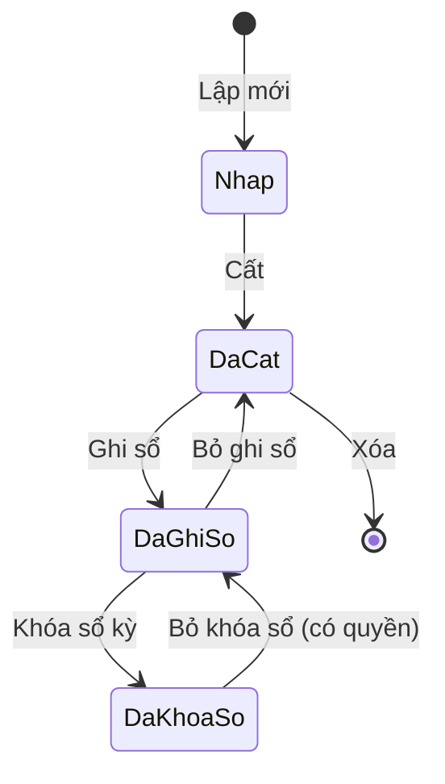

# Kiến trúc hệ thống Konek Két (v1)

> **Tài liệu này mô tả kiến trúc ĐÍCH của cả v1**, phần lớn chưa dựng. Phần đã
> chạy thật tới hôm nay xem §1b; chi tiết mã nguồn hiện có xem
> `docs/codebase-summary.md`. Đọc nhầm tài liệu này thành "hệ thống hiện tại" là
> hiểu sai khoảng 90% nội dung.

## 1. Mục tiêu & bối cảnh

Phần mềm kế toán doanh nghiệp Việt Nam chạy **offline hoàn toàn trên một máy hoặc LAN** (mô hình desktop tại từng máy trạm + DB dùng chung). Không cloud v1. Đáp ứng TT200/TT133, xử lý trọn vòng đời chứng từ, hỗ trợ đa chi nhánh, đa tiền tệ, HĐĐT.

**Ba mục tiêu chất lượng chi phối thiết kế, theo thứ tự:**
1. **Đúng số liệu** (FR-NFR-001..007) — sai số liệu thì mọi ưu điểm khác vô nghĩa.
2. **Cấu hình thay vì sửa code** (FR-NFR-055, N7) — khi thông tư thay đổi, kích hoạt gói cấu hình, không sửa mã nguồn.
3. **Không phải viết lại** (N1, LD-03) — khi thêm phân hệ, thêm báo cáo, nối nhiều bản cài → kiến trúc lõi chịu được.

---

## 1b. Trạng thái hiện thực hóa (2026-08-15)

| Thành phần | Trạng thái |
| --- | --- |
| Vai trò DB `ket_owner` / `ket_app`, tách quyền sở hữu | ✅ chạy thật |
| Schema-per-dataset: schema điều khiển, provisioning, định tuyến `search_path` | ✅ chạy thật |
| Migration `0001` — 11 bảng nền (RBAC, settings, audit, idempotency, jobs, numbering, branches) | ✅ chạy thật |
| RLS cô lập chi nhánh theo GUC `ket.branch_ids` | ✅ chạy thật (trên `audit_log`, `jobs`) |
| Nhật ký bất biến ghi cùng transaction | ✅ chạy thật |
| `ket.kernel.money` — Decimal, ROUND_HALF_UP | ✅ chạy thật |
| Kiểm phiên bản schema lúc khởi động (LD-05) | ✅ chạy thật |
| **Cô lập dataset bằng vai trò per-dataset `ds_<mã>_app` (D3)**; luật cứng AST quét tiêm SQL | ✅ chạy thật (2B-0) |
| **PostgreSQL 16 là phiên bản tối thiểu (D4)**; app từ chối PG < 16 | ✅ chạy thật (2B-0) |
| **Kênh phát hành Windows+macOS** (release.yml, minisign ký gói updater) | ⚠️ đã dựng, **chưa chạy lần nào** — đường build Windows chưa xác minh (máy phát triển là macOS); bộ cài chưa ký chứng thư OS |
| **Danh tính**: Argon2id, phiên lưu DB thu hồi được ngay, 2FA TOTP chống phát lại, khóa tạm, RFC 7807 | ✅ chạy thật (2B-1a) |
| **RBAC enforcement** `{module}.{chứng từ}.{hành vi}` sinh từ registry; định tuyến dataset theo header `X-Dataset`; phạm vi chi nhánh cho RLS | ✅ chạy thật (2B-1b) |
| Idempotency · optimistic locking · worker + reaper · sinh type OpenAPI | ⏳ phase 2 lát 2B-2 |
| Client (design system, layout, đăng nhập, handshake, i18n) · spike S1/S3/S4 | ⏳ phase 2 lát 2C |
| Posting engine, báo cáo, và toàn bộ phân hệ nghiệp vụ | ⏳ phase 4 trở đi |

Bảng còn lại trong §11 và phần lớn §12 là **thiết kế đích**, chưa có mã.

---

## 2. Bảy nguyên lý ràng buộc toàn hệ thống

| # | Nguyên lý (N) | Hiện thực hóa | ADR / Phase |
| --- | --- | --- | --- |
| N1 | Báo cáo chỉ từ chứng từ đã ghi sổ | Một bảng phát sinh chung `gl_postings` (append-only); không nhập trực tiếp sổ/báo cáo | ADR-005; phase-4 |
| N2 | Tách "cất" và "ghi sổ" | Chứng từ hai trạng thái; tùy chọn "cất không ghi sổ" hoặc "cất đồng thời ghi sổ" | phase-4 |
| N3 | Hai sổ song song (tài chính + quản trị) | Cột `ledger ENUM('financial','management')` trên tất cả bảng phát sinh + số dư | ADR-006; phase-4 |
| N4 | Đa chi nhánh | Mọi chứng từ gắn chi nhánh; cô lập bằng RLS trên bảng gốc (GUC tenant per-request) | RT-04; phase-2 |
| N5 | Đa tiền tệ | Mỗi dòng lưu bộ (currency, rate, amount_fc, amount_debit, amount_credit); sổ cái quy VND | phase-3, phase-4 |
| N6 | Kỳ khóa được | Sau khóa sổ, chứng từ trong kỳ chặn sửa/xóa; chứng từ lùi ngày có quy trình tính lại | phase-4, phase-8 |
| N7 | Chế độ kế toán là cấu hình | TT200/TT133 quyết định hệ thống TK, mẫu chứng từ, BCTC — tất cả dữ liệu config có hiệu lực theo ngày | ADR-008; phase-5 |

---

## 3. Sơ đồ thành phần


Ký số USB token nằm ở **dịch vụ esign riêng** trên máy người ký (không nhúng PKCS#11 vào app server — LD-04). App server gọi esign ký **đồng bộ trước khi đưa vào outbox**; outbox chỉ retry **truyền tải XML đã ký**.

---

## 4. Topology & chế độ triển khai

| Chế độ | Cấu hình | Ghi chú |
| --- | --- | --- |
| **LAN** (mặc định) | App server + PostgreSQL trên host (hoặc DB riêng); 5–50 client. Client bind URL `https://host:5443` | Cấu hình mạng; không nhánh code riêng |
| **Một máy (offline)** | App server + PostgreSQL + client cùng PC, bind `127.0.0.1` | Cùng binary, khác file cấu hình; offline hoàn toàn |
| **Tương lai v1.x: trình duyệt LAN** | App server phục vụ chính bundle web UI tại `/app`; dùng Chrome/Edge mở tại `https://host:5443/app` | Chỉ mất tính năng Tauri (USB token, in, chọn folder). **Không làm v1 nhưng cấm thiết kế chặn** |
| **Tương lai: nối nhiều bản cài** | Thêm module đồng bộ đọc/ghi qua REST API (đã có sẵn). **Cam kết v1: tổng hợp một chiều** lên trụ sở | Danh mục có `uid UUIDv7` ổn định để nối sau; RT-19 |

**Quy tắc bất di dịch:** client **không bao giờ nối thẳng PostgreSQL**. Mọi phép tính tiền, đánh số, ghi sổ, kiểm tra quyền đều ở server (loại 2-tier khỏi LD-01).

---

## 5. State machine chứng từ



**Bất biến:**
- Chỉ `ket.posting` module ghi vào `gl_postings`.
- `gl_postings` append-only — không UPDATE/DELETE dòng phát sinh đã ghi.
- Chứng từ **chưa ghi sổ** không lên báo cáo phân tích; hiển thị khác màu danh sách.
- Chứng từ **đã khóa sổ**: chỉ đọc; tùy cấu hình có in được hay không.

---

## 6. Bố cục solution (modular monolith)

```
server/
  pyproject.toml                     # uv/poetry, ruff, mypy strict, pytest
  alembic.ini
  src/ket/
    main.py                          # FastAPI app factory, router mount, lifespan
    kernel/                          # shared kernel (phase 3)
      persistence/ security/ auditing/ config/ numbering/ currency/
      periods/ organization/ master_data/ dimensions/ excel/ jobs/ errors/
    posting/                         # posting engine + balances (phase 4)
    reporting/                       # report engine + renderers (phase 5)
    modules/
      cash_book/                     # QUY (phase 6)
      bank/                          # BNK (phase 6)
      purchase/                      # PUR (phase 7)
      sales/                         # SAL (phase 7)
      einvoice/                      # EIV + INV (phase 7)
      receivables/                   # AR/AP subledger (phase 7 — RT-18)
      inventory/                     # STK (phase 8)
      tools/                         # CCD (phase 8)
      fixed_assets/                  # TSC (phase 8)
      tax/                           # TAX (phase 9)
      payroll/                       # PAY (phase 9)
      costing/                       # CST (phase 9)
      general_ledger/                # GLE (phase 10a)
      warehousing/                   # WHK queue (phase 6 + 8)
    worker/                          # heavy async job pool
  migrations/versions/               # Alembic
  tests/                             # unit + integration (pytest)

client/                              # Tauri + web UI (TypeScript)
  src-tauri/                         # Rust shell: updater, print, file, USB bridge
  src/
    app/                             # router, layout, providers
    design-system/                   # tokens Konek + base components
    lib/                             # apiClient, auth, i18n, formatters
    features/                        # grouped by UI screen (not backend module)
      tien-vao-tien-ra/ mua-hang/ ban-hang/ hoa-don-dien-tu/
      kho/ tai-san/ luong/ so-sach-thue/ danh-muc-thiet-lap/
  packages/api-types/                # TypeScript types from OpenAPI
```

---

## 7. Luật phụ thuộc (5 ép tự động, 2 review)

**Ép tự động bằng `import-linter` trong CI:**
1. **C1**: `ket.kernel` không import `ket.modules.*` hay `ket.posting`.
2. **C2/C3**: `ket.modules.*` không import module khác (chỉ được import `ket.kernel`, `ket.posting`); nếu cần dữ liệu module khác → qua **Protocol trong kernel** đăng ký lúc khởi động, hoặc qua **domain event**.
3. **C4** (chỉ review, không ép import-linter): Chỉ `ket.posting` được INSERT vào `gl_postings` — module khác gọi `PostingService`.
4. **C5**: `ket.reporting` chỉ **đọc** (chặn import các module khác để ghi DB).
5. **UI**: Web UI chỉ biết REST API + type sinh từ OpenAPI — eslint `no-restricted-imports` chặn gọi API Tauri trong logic.

**Review (code review, không ép tự động):**
6. **Cấm `dict[str, Any]` qua ranh giới module** — dùng Pydantic model hoặc dataclass có kiểu (mypy strict phát hiện, LD-13).

---

## 8. Ánh xạ 18 phân hệ SRS → mã FR → package server → nhóm màn hình → phase

| SRS | Phân hệ | Mã FR | Package server | Nhóm màn hình (UI) | Phase |
| --- | --- | --- | --- | --- | --- |
| 01 | Danh mục | SYS | `ket.kernel` | Danh mục & Thiết lập | 3 |
| 02 | Số dư ban đầu | OPB | `ket.posting` | Danh mục & Thiết lập | 4 |
| 03 | Quỹ tiền mặt | QUY | `ket.modules.cash_book` | Tiền vào tiền ra | 6 |
| 04 | Ngân hàng | BNK | `ket.modules.bank` | Tiền vào tiền ra | 6 |
| 05 | Mua hàng | PUR | `ket.modules.purchase` | Mua hàng | 7 |
| 06 | Bán hàng | SAL | `ket.modules.sales` | Bán hàng | 7 |
| 07 | HĐĐT cấp số | EIV | `ket.modules.einvoice` | Hóa đơn điện tử | 7 |
| 08 | Quản lý hóa đơn | INV | `ket.modules.einvoice` | Hóa đơn điện tử | 7 |
| 09 | Kho | STK | `ket.modules.inventory` | Kho | 8 |
| 10 | CCDC | CCD | `ket.modules.tools` | Tài sản | 8 |
| 11 | TSCĐ | TSC | `ket.modules.fixed_assets` | Tài sản | 8 |
| 12 | Thuế | TAX | `ket.modules.tax` | Sổ sách & Thuế | 9 |
| 13 | Tiền lương | PAY | `ket.modules.payroll` | Lương & Nhân sự | 9 |
| 14 | Giá thành | CST | `ket.modules.costing` | Sổ sách & Thuế | 9 |
| 15 | Tổng hợp & GL | GLE | `ket.modules.general_ledger` | Sổ sách & Thuế | 10a |
| 16 | Hợp đồng & Ngân sách | CTR | *(hoãn v1.1)* | — | — |
| 17 | Thủ kho / Thủ quỹ | WHK | `ket.modules.warehousing` | Tiền vào tiền ra (thủ quỹ) / Kho (thủ kho) | 6, 8 |
| 18 | Báo cáo & phân tích | RPT | `ket.reporting` | xuyên suốt; **dashboard §4 = hoãn 10b** | 5, 10a, 10b |
| — | AR/AP công nợ subledger | — | `ket.modules.receivables` | Mua/Bán/Công nợ | 7 |
| 20 | Đặc thù ngành | IND | *(hoãn v1.1 — phủ bằng chiều mở rộng + gói config)* | — | — |

---

## 9. IA màn hình ≠ ranh giới module

Backend giữ **nguyên module theo SRS**; UI gộp **theo công việc người dùng**:

| Nhóm màn hình (UI) | Module backend | Giải thích |
| --- | --- | --- |
| Tiền vào tiền ra | QUY + BNK | Một màn, thẻ trên cùng: Quỹ + từng TK ngân hàng; lưới đổi theo. Backend vẫn 2 module. BFF `cashflow/overview` gọi cả 2. |
| Tài sản | TSCĐ + CCDC | Một danh sách, cột "Cách phân bổ" phân biệt. Backend vẫn 2 module. BFF `assets/list` gọi cả 2. |
| Danh mục đối tác | SYS (MasterData) | Một danh mục dùng chung mua+bán; thẻ công nợ hiện ngay. BFF `partners/{id}/overview` gọi module `receivables` subledger. |
| Mua hàng | PUR | 1-1 với module. Router của `purchase` phục vụ trực tiếp. |
| Bán hàng | SAL | 1-1 với module. Router của `sales` phục vụ trực tiếp. |
| Hóa đơn điện tử | EIV + INV | Một màn HĐĐT; nội bộ gọi outbox/trạng thái từ 2 module. API gộp hoặc BFF. |
| Sổ sách & Thuế | GLE + TAX + RPT | Sổ cái drill-down, khóa sổ là danh mục kiểm tra, tờ khai gộp. BFF `statements/financial-package` + `period-close/checklist` gọi cả 3. |

**Quy tắc RT-21:** **một BFF endpoint tồn tại KHI VÀ CHỈ KHI một màn hình đọc ≥2 module**. Nếu chỉ đọc 1 module → router của module đó phục vụ trực tiếp. **Bốn BFF chính đáng:**
- `GET /cashflow/overview` (quỹ + ngân hàng)
- `GET /assets/list` (TSCĐ + CCDC)
- `GET /partners/{id}/overview` (danh mục + công nợ subledger)
- `GET /statements/financial-package` + `GET /period-close/checklist` (GL + TAX + báo cáo)

**BFF là read-only**; ghi luôn gọi API module riêng.

---

## 10. Kiến trúc dữ liệu — điểm chốt

| Vấn đề | Quyết định | Phase |
| --- | --- | --- |
| **Posting** | Header `vouchers` chung + bảng chi tiết riêng từng module + **một bảng phát sinh chung `gl_postings` append-only** | 4 |
| **Hai sổ** | Cột `ledger ENUM('financial','management')` trên `gl_postings`, `account_balances`, bảng số dư đầu kỳ | 4 |
| **Chiều phân tích** | 6 cột cố định + bảng `posting_dimension_values (posting_id, dimension_id, value_id)` | 3, 4 |
| **Đa tiền tệ** | Mỗi dòng lưu (currency, rate, amount_fc, amount_debit, amount_credit); sổ cái quy VND | 3, 4 |
| **Số dư** (RT-22) | Hybrid: `gl_postings` là nguồn sự thật + snapshot `account_balances` **khóa chỉ `(kỳ, sổ, chi nhánh, TK, tiền tệ)`** — **KHÔNG mang chiều/đối tác/vật tư** (nổ tổ hợp). Đối tác → `ar_ap_ledger`, vật tư → `inventory_balances`, chiều → `gl_postings` có index | 4 |
| **Chứng từ lùi ngày** | Đánh dấu dirty snapshot + hàng đợi tính lại kiểm soát; **chặn tính lại ngầm** (RT-11) | 4, 8 |
| **Đánh số** (RT-12) | Bảng counter + `SELECT … FOR UPDATE`; idempotency key ghi cùng txn business write, scope theo route, miễn `/reports`,`/jobs` | 2, 3 |
| **Nhật ký** (RT-02) | `audit_log` thuộc `ket_owner`; `ket_app` chỉ INSERT/SELECT (không UPDATE/DELETE/DROP); ghi trước–sau JSONB theo schema dataset | 2 |
| **Nhiều dữ liệu kế toán** (RT-17, D2) | **Schema-per-dataset trong 1 PG DB (ADR-017)**; routing schema session; handshake/đánh số/audit/RLS/backup per-schema | 2, 3, 11 |
| **Cấu hình pháp lý** (RT-07) | `config_packages` + bảng con có `effective_from/to` + `scheme(TT200/TT133)`; ký số; SQL/template sandbox | 5 |
| **Báo cáo** (RT-01, RT-04) | Metadata-driven: `report_definitions` (dataset + layout + params); render server-side; mẫu in Jinja2 sandbox + WeasyPrint `url_fetcher` chặn `file://`; **RLS trên bảng gốc** | 5 |
| **Tồn kho** | `inventory_balances (branch, warehouse, item, lot_id NULL, serial_id NULL)` khóa từ ngày đầu | 8 |

---

## 11. Danh sách bảng lõi

| Tên bảng | Mục đích | Phase | Module sở hữu |
| --- | --- | --- | --- |
| `vouchers` | Header chứng từ chung (date, type, ref, status, branch, …) | 4 | `posting` |
| `gl_postings` | Phát sinh kế toán (append-only, hai sổ, chiều phân tích) | 4 | `posting` |
| `account_balances` | Snapshot số dư (khóa compact: period, ledger, branch, account, currency) | 4 | `posting` |
| `posting_dimension_values` | Chiều phân tích mở rộng | 3, 4 | `kernel` |
| `ar_ap_ledger` | Công nợ subledger (đối tác + TK + số tiền nợ) | 7 | `receivables` |
| `inventory_balances` | Tồn kho (warehouse, item, lot, serial, qty) | 8 | `inventory` |
| `audit_log` | Nhật ký bất biến (người, hành động, giá trị trước–sau) | 2 | `ket_owner` |
| `config_packages` | Gói cấu hình pháp lý (TT200/TT133, hiệu lực từ…) | 5 | `kernel` |
| `report_definitions` | Báo cáo metadata (layout, tham số, query) | 5 | `reporting` |
| `number_sequences` | Bộ đếm đánh số chứng từ (`scope_key` gói cả chi nhánh + năm) | 2 (bảng), 3 (cấp số) | `kernel` |
| `idempotency_keys` | Khóa idempotency + kết quả (TTL, result_ref) | 2 | `kernel` |
| `jobs` | Tác vụ nền (hàng đợi, tiến độ, lease, reaper) | 2 | `worker` |
| `periods` | Kỳ kế toán (từ, đến, trạng thái khóa) | 3 | `kernel` |
| `branches` | Chi nhánh (mã, tên, địa chỉ). **Không bật RLS** — xem ADR-017 §6 | 2 (lõi), 3 (mở rộng) | `kernel` |
| `accounts` | Tài khoản (mã, tên, loại, nhóm công thức BCTC) | 3 | `kernel` |
| `partners` | Đối tác (khách, NCC, nhân viên, …) | 3 | `kernel` |
| `items` | Vật tư hàng hóa (mã, tên, ĐVT, định mức) | 3 | `kernel` |
| `currencies` | Ngoại tệ (mã ISO, tên, số lẻ) | 3 | `kernel` |
| `exchange_rates` | Tỷ giá (ngày, từ-tới, tỷ lệ) | 3 | `kernel` |
| `bank_statement_profiles` | Mapping sao kê ngân hàng (per-bank format) | 3 | `kernel` |
| `datasets` | Dữ liệu kế toán (DN, năm, schema) — schema điều khiển `public` | 2, 3 | `kernel` |
| `users` | Danh tính đăng nhập **toàn cục** — schema điều khiển `public` | 2 | `kernel` |
| `system_metadata` | Phiên bản schema điều khiển, dữ liệu handshake — `public` | 2 | `kernel` |
| `roles`, `permissions`, `role_permissions`, `user_roles`, `user_branches` | RBAC **per-dataset** | 2 | `kernel` |
| `settings` | Tùy chọn hai cấp (chung hệ thống / riêng người dùng) | 2 | `kernel` |

---

## 12. Cross-cutting concerns

| Mối quan tâm | Thiết kế | FR | Phase |
| --- | --- | --- | --- |
| **Xác thực** | User/password + policy; 2FA cho quản trị + ngân hàng; token phiên hạn | FR-NFR-010/016, FR-SYS-070/075 | 2 |
| **Phân quyền (RT-04)** | RBAC: role × (loại chứng từ) × (hành vi) × chi nhánh ở server. **RLS chi nhánh trên bảng gốc theo GUC `ket.branch_ids` mỗi transaction** (không dựa filter tầng app); GUC chưa đặt = không thấy dòng nào (fail-closed). Danh mục `branches` và bảng nguồn `user_branches` không bật RLS — ADR-017 §6 | FR-NFR-011, FR-SYS-071/072/074 | 2, 5 |
| **Nhật ký (RT-02)** | Listener ghi mọi thêm/sửa/xóa/ghi sổ/bỏ ghi sổ/khóa sổ, **trong cùng transaction** với thao tác nghiệp vụ (rollback thì mất theo; flush hỏng không để lại diff trôi sang lần ghi sau). `audit_log` ⊂ `ket_owner`; `ket_app` **không UPDATE/DELETE/DROP** được. `search_path` nêu `pg_temp` **cuối cùng** + thu hồi quyền `TEMPORARY`: nếu không, một `CREATE TEMP TABLE audit_log` che được bảng thật và vô hiệu hóa nhật ký mà không cần sửa/xóa dòng nào | FR-NFR-012/013, FR-SYS-073 | 2 |
| **Bảo mật khóa/bí mật (RT-05)** | `totp_secret`, token eSign, creds DB **mã hóa bằng khóa app ở OS keystore** | FR-NFR-014/015 | 2, 11 |
| **Kênh app→DB (RT-06)** | TLS verify-full; `scram-sha-256` pg_hba; **cấm superuser làm app login**; creds keystore | FR-NFR-014 | 11 |
| **Đa ngôn ngữ** | Resource vi/en cho UI + cột `name_en` danh mục & hệ thống TK | FR-NFR-034 | 3, 5 |
| **Sao lưu/khôi phục (RT-03)** | `pg_dump`/`pg_restore` **per-schema dataset**, theo lịch + yêu cầu, checksum. **Bắt buộc mã hóa** backup chứa PII (khóa OS keystore) | FR-NFR-020..023, FR-NFR-073 | 11 |
| **Tác vụ nặng (RT-13)** | Hàng đợi job trong DB + **worker tiến trình riêng** (không FastAPI), có tiến độ + hủy + lease/heartbeat/reaper. **Set-based SQL**, Python chỉ điều phối (LD-14) | FR-NFR-042/044 | 2, 8, 9 |
| **Lỗi** | Mã lỗi nghiệp vụ + thông điệp Việt nêu nguyên nhân + cách xử lý; không lộ exception | FR-NFR-050 | 2 |
| **Đính kèm** | File lưu ngoài DB theo content-hash; DB lưu metadata | FR-NFR-053 | 6 |

---

## 13. Ánh xạ 6 rủi ro kiến trúc → ADR xử lý

| # | Rủi ro (SRS 19 §9) | Ảnh hưởng | ADR xử lý | Phase |
| --- | --- | --- | --- | --- |
| 1 | Hard-code TK/BCTC/tờ khai → sửa code mỗi lần thông tư đổi | Thời gian phát triển bùng nổ | ADR-008 (gói config TT200/TT133 với hiệu lực theo ngày) | 5 |
| 2 | Xây ~155 báo cáo riêng lẻ → bảo trì không khả thi | Chi phí bùng nổ | ADR-009 (report engine metadata-driven) | 5 |
| 3 | Tồn kho không tính serial/lô từ đầu → không thêm được | Kiến trúc data phải viết lại | ADR-010 (schema `lot/serial` từ phase 1, UI hoãn) | 8 |
| 4 | Hai sổ thêm sau → sửa tất cả bảng phát sinh + số dư | Effort và rủi ro kiến trúc rất cao | ADR-006 (cột `ledger` từ phase 1) | 4 |
| 5 | Chiều phân tích cố định → không đủ cho đặc thù ngành | Mỗi ngành mới sửa schema | ADR-007 (6 cột cố định + chiều mở rộng cấu hình) | 3, 4 |
| 6 | Tính giá xuất kho BQ tức thời khi chèn lùi ngày → sai giá vốn | Khó phát hiện, hậu quả lớn | ADR-011 (đánh dấu dirty + tính lại kiểm soát, cấm ngầm) | 4, 8 |

---

## 14. Lệch báo cáo nghiên cứu

Báo cáo tech-stack khuyến nghị **C#/.NET 8 app server + Avalonia client**. Người dùng chốt **Python/FastAPI server + Tauri/React client** theo năng lực đội (Python/Odoo background) và design system web-first. 

Các kết luận **độc lập ngôn ngữ** từ báo cáo giữ nguyên: 3-tier, PostgreSQL, render báo cáo phía server, adapter HĐĐT, ký số qua dịch vụ esign, khóa schema-version, optimistic locking, idempotency.

**Hai runner-up stack ghi nhận:**
- **C#/.NET 8 Avalonia**: kiểm kiểu lúc biên dịch, `decimal` sẵn ngôn ngữ, đóng gói/.NET Windows gọn. Nhược: không nền C#, không tái dùng design web-first.
- **Tauri + C# server**: giữ design system web-first nhưng vẫn lệch năng lực đội.

Hợp đồng client-server = **REST + OpenAPI** → đổi tầng nào cũng không kéo tầng kia.

---

## 15. Hai rủi ro đã biết của stack

1. **Lưới nhập liệu web 500 dòng + IME tiếng Việt** — gõ không trễ là yêu cầu hàng ngày. Spike S3 (phase 2) kiểm chứng. Plan-B: AG Grid Enterprise hoặc Glide Data Grid.
2. **Đóng gói Python thành installer 1-bấm** — server phải cài được người không IT (runtime nhúng + dịch vụ Windows). Điểm yếu rõ so với .NET. Spike S4 (phase 2, hoàn thiện phase 11) kiểm chứng.

---

## Tham chiếu

- **Locked Architecture Decisions:** `plans/260814-2204-accounting-system-architecture/plan.md` §Locked Architecture Decisions
- **Red Team Review:** `plans/260814-2204-accounting-system-architecture/plan.md` §Red Team Review (RT-01..27)
- **SRS Nguyên lý:** `docs/srs/00-tong-quan-va-pham-vi.md` §3.2–3.3
- **SRS Phạm vi:** `docs/srs/00-tong-quan-va-pham-vi.md` §4
- **SRS Rủi ro:** `docs/srs/19-yeu-cau-phi-chuc-nang.md` §9
